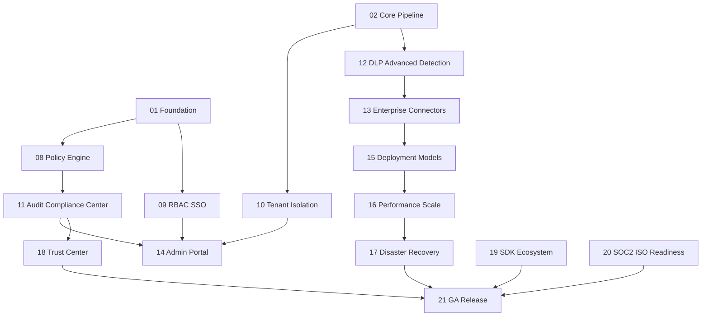

# AnonReq Master Dependency Graph

## Phase Dependencies

## Shared Technical Dependencies

FastAPI and Pydantic v2 define API contracts. Valkey is required before forwarding. PostgreSQL is required for durable enterprise metadata. OpenTelemetry, Prometheus, and structured logging are required before SLO and compliance reporting. OpenAPI schema stability is required before SDK release.
