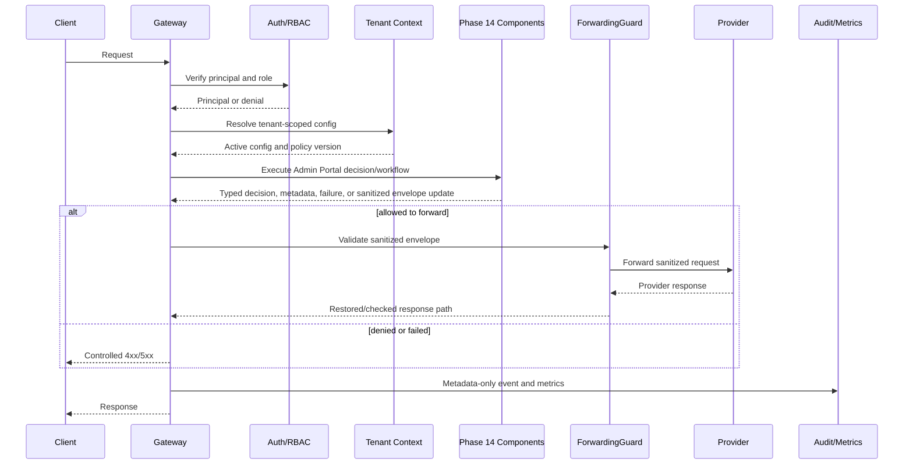

# Phase 14 Architecture: Admin Portal

References: [MASTER-ARCHITECTURE.md](../../.planning/MASTER-ARCHITECTURE.md), [MASTER-SECURITY-MODEL.md](../../.planning/MASTER-SECURITY-MODEL.md), [MASTER-TEST-STRATEGY.md](../../.planning/MASTER-TEST-STRATEGY.md)

## Components

- **AdminFrontend**: owns a bounded part of the phase capability and exposes typed interfaces to the gateway orchestration layer.
- **AdminBFF**: owns a bounded part of the phase capability and exposes typed interfaces to the gateway orchestration layer.
- **PermissionAwareNavigation**: owns a bounded part of the phase capability and exposes typed interfaces to the gateway orchestration layer.
- **PolicyEditor**: owns a bounded part of the phase capability and exposes typed interfaces to the gateway orchestration layer.
- **OversightQueueUI**: owns a bounded part of the phase capability and exposes typed interfaces to the gateway orchestration layer.
- **EvidenceExportUI**: owns a bounded part of the phase capability and exposes typed interfaces to the gateway orchestration layer.
- **IncidentWorkbench**: owns a bounded part of the phase capability and exposes typed interfaces to the gateway orchestration layer.
- **GovernanceDashboard**: owns a bounded part of the phase capability and exposes typed interfaces to the gateway orchestration layer.

## Sequence Diagram

## Data Flow

Inputs are accepted only after authentication, schema validation, tenant resolution, and configuration version binding. Phase data structures carry tenant ID, session ID, actor ID, policy version, and correlation ID. Sensitive runtime values remain in memory and are never copied into durable records. Durable records contain counts, hashes, status codes, policy actions, timestamps, and HMAC-verifiable identifiers.

## Failure Modes

- Missing or unknown tenant: reject before phase execution.
- Dependency unavailable: return 503 and emit fail-secure metric.
- Invalid phase configuration: reject activation or fail startup.
- Partial write to audit/evidence: preserve request outcome where safe, increment failure metric, and retry only for durable evidence workers.
- Provider forwarding attempted without sanitized envelope: block in ForwardingGuard.

## Threat Model

The portal is metadata-only: it never renders raw prompts, raw responses, token strings, provider secrets, or original detected values. Additional threats are tenant confusion, stale configuration, unauthorized administration, log injection, schema drift, and denial-of-service through expensive evaluation paths. Mitigations are context-derived tenant scoping, immutable config versioning, RBAC checks, field allowlists, OpenAPI contract tests, latency budgets, and bounded queues.

## OpenAPI Changes

- `GET /admin`
- `GET /v1/admin/ui/bootstrap`
- `POST /v1/oversight/{request_id}/approve`
- `POST /v1/oversight/{request_id}/reject`
- `POST /v1/oversight/kill-switch`

All endpoints use Pydantic v2 request/response models, structured error bodies, explicit RBAC metadata, tenant-aware filtering, and OpenAPI examples with synthetic data only.

## Metrics

- `anonreq_admin_actions_total`
- `anonreq_admin_page_load_seconds`
- `anonreq_oversight_queue_depth`
- `anonreq_kill_switch_state`

Each metric is labeled by `tenant_id` only where authorized and where cardinality is bounded. No labels contain raw payload fragments, token strings, secrets, or user-provided free text.
