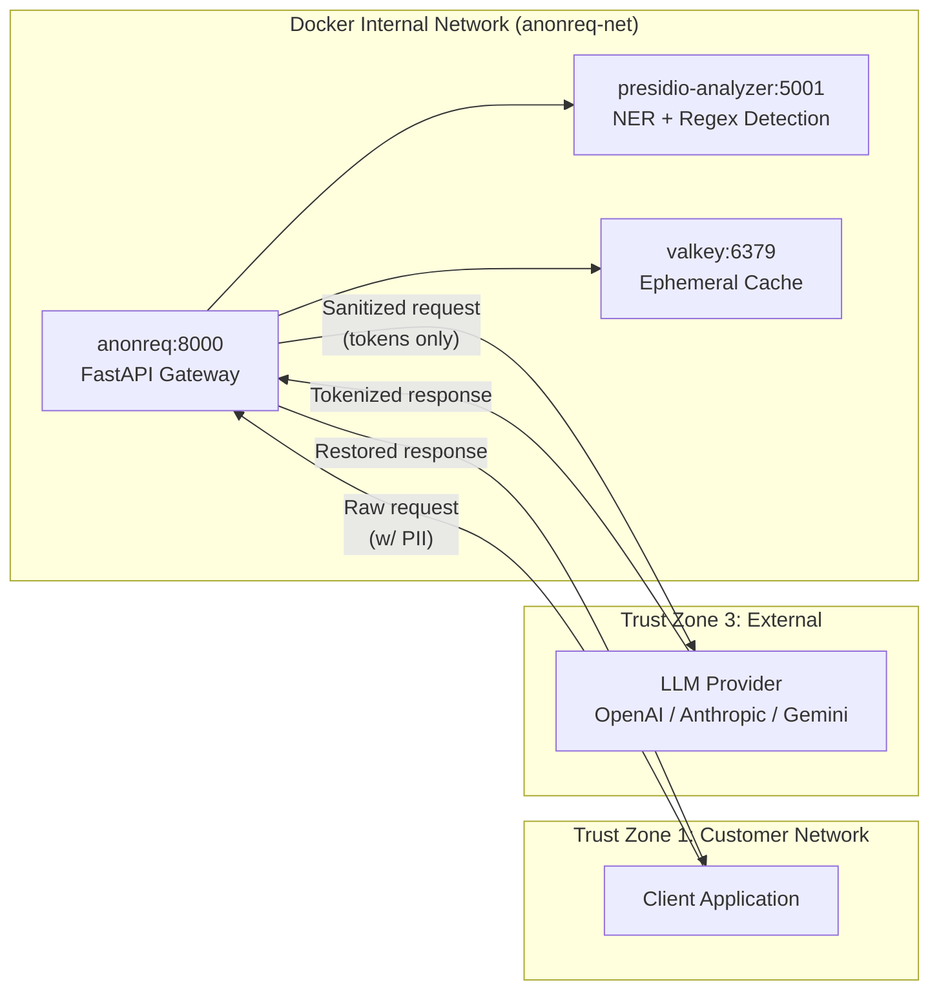

# Production Readiness Review — AnonReq v1.0

## Deployment Architecture

**Request flow:** Client → Gateway receives request → Classification (Block/Route/Anonymize/Pass) → Detection Engine (Presidio Analyzer) → Tokenization Engine → Cache mapping (Valkey) → Provider Adapter → External LLM → Response Restoration → Response to client.

## Dependency Matrix

| Component | Role | Depends On | Port | Protocol |
|-----------|------|------------|------|----------|
| **anonreq** | FastAPI proxy gateway | presidio-analyzer:5001, valkey:6379 | 8000 | HTTP |
| **presidio-analyzer** | PII detection (NER + regex) | spaCy model (`en_core_web_sm`) at startup | 5001 | HTTP |
| **valkey** | Ephemeral session cache | Standalone (no deps) | 6379 | RESP |

### Python Library Dependencies (anonreq)

FastAPI, uvicorn[standard], pydantic-settings, httpx, presidio-analyzer, structlog, prometheus-client, jose[cryptography], pyyaml, hypothesis.

## Resource Requirements

| Container | CPU (min) | CPU (rec) | RAM (min) | RAM (rec) | Disk |
|-----------|-----------|-----------|-----------|-----------|------|
| anonreq | 1 CPU | 2 CPU | 1 GB | 2 GB | Ephemeral (logs via Docker) |
| presidio-analyzer | 2 CPU | 4 CPU | 2 GB | 4 GB | Ephemeral (model cached in RAM) |
| valkey | 0.5 CPU | 1 CPU | 256 MB | 512 MB | Ephemeral (`save ""`, no RDB/AOF) |
| **Total** | **3.5 CPU** | **7 CPU** | **~3.3 GB** | **~6.5 GB** | |

## Scaling Limits

| Dimension | Default | Maximum | Bottleneck |
|-----------|---------|---------|------------|
| Concurrent requests | 100 | 500 | Valkey connection pool × gunicorn workers |
| Throughput (P95 overhead) | ≤ 100ms | — | Presidio detection latency (1,000-word prompt) |
| gunicorn workers | 4 | 8–16 | CPU cores available to container |
| Valkey max_connections | 100 | 10,000 | Container memory |

Gateway is stateless — horizontal scale via `gunicorn --workers N` and `docker compose scale anonreq=N`.

## Non-Functional Requirements Validation

| Req ID | Description | Verification Status | Evidence |
|--------|-------------|-------------------|----------|
| FAIL-01–04 | Fail-secure error boundaries | Pending Phase 6 execution | Phase 6 property tests |
| DOCK-01–07 | Docker deployment | Pending Phase 1 execution | docker compose up verification |
| CACH-01–06 | Cache operations | Pending Phase 2 execution | Integration tests |
| TOKN-01–07 | Tokenization correctness | Pending Phase 2 execution | Hypothesis tests |
| PIPE-06 | P95 ≤ 100ms overhead | Pending Phase 5 execution | k6 load test results |
| AUTH-MINIMAL-01 | Static bearer auth | Pending Phase 1 execution | Auth integration tests |
| AUDT-01–05 | Audit logging | Pending Phase 2 execution | Audit log verification |

## Configuration Surface

| Variable | Required | Default | Description |
|----------|----------|---------|-------------|
| `ANONREQ_API_KEY` | Yes | — | Static bearer token (≥ 32 chars) |
| `ANONREQ_LOG_LEVEL` | No | `INFO` | Logging level |
| `ANONREQ_CACHE_URL` | No | `valkey://localhost:6379` | Valkey connection URL |
| `ANONREQ_CACHE_TTL` | No | `600` | Session TTL in seconds |
| `ANONREQ_CACHE_PASSWORD` | No | — | Valkey requirepass |
| `ANONREQ_OPENAI_API_KEY` | Conditional | — | OpenAI provider key |
| `ANONREQ_ANTHROPIC_API_KEY` | Conditional | — | Anthropic provider key |
| `ANONREQ_GEMINI_API_KEY` | Conditional | — | Gemini provider key |
| `ANONREQ_LOCALE` | No | `en-US` | Default detection locale |
| `ANONREQ_COMPLIANCE_PRESET` | No | — | Compliance preset name |
| `ANONREQ_CONFIDENCE_THRESHOLD` | No | `0.7` | Detection confidence threshold |
| `PRESIDIO_ANALYZER_URL` | No | `http://presidio-analyzer:5001` | Presidio service URL |

## Pre-Flight Validation

| Check | Failure Mode | Error Message |
|-------|-------------|---------------|
| Valkey reachable | Connection refused / timeout | `CACHE_UNREACHABLE: Cannot connect to Valkey at {url}` |
| Valkey persistence disabled | `save` not empty | `CACHE_PERSISTENCE_ENABLED: Valkey must run with save ""` |
| Presidio reachable | HTTP connection error | `PRESIDIO_UNREACHABLE: Presidio Analyzer not responding at {url}` |
| Presidio model loaded | 503 from /health | `PRESIDIO_MODEL_MISSING: spaCy model not loaded` |
| API key set | Env var missing | `ANONREQ_API_KEY is not set` |
| API key length | < 32 characters | `ANONREQ_API_KEY must be at least 32 characters` |
| All required env vars present | Missing required var | `Missing required env var: {NAME}` |
