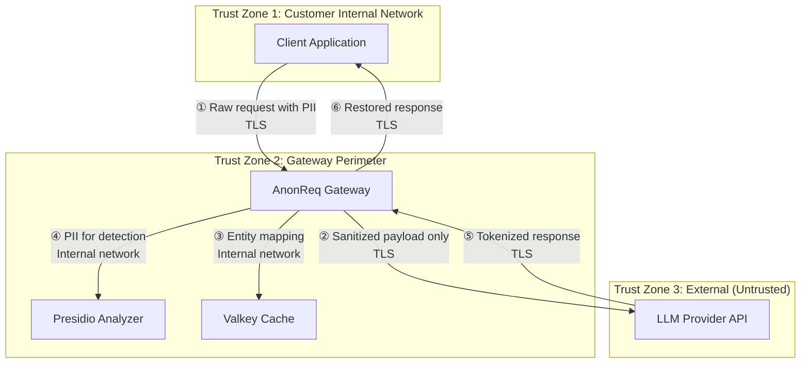
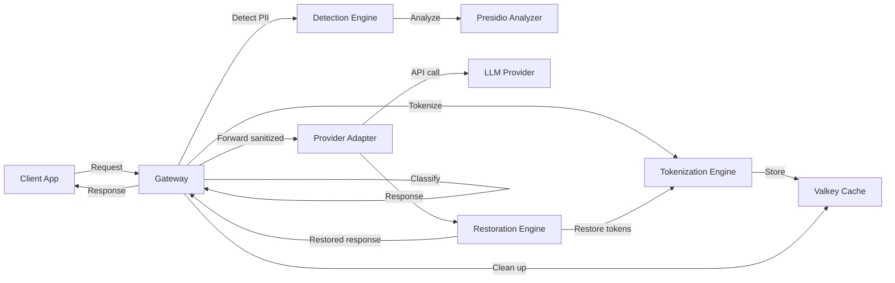

# Threat Model — AnonReq v1.0

## Trust Boundaries

**Boundary Crossings:**

| # | From | To | Data | Risk |
|---|------|----|------|------|
| ① | Customer network | Gateway | Raw PII | Gateway compromise exposes raw data |
| ② | Gateway | LLM provider | Sanitized tokens only | Token reversal via enumeration |
| ③ | Gateway | Valkey | Entity↔token mapping | Cache compromise reveals mappings |
| ④ | Gateway | Presidio | Raw PII substrings | Presidio compromise exposes PII |
| ⑤ | LLM provider | Gateway | Tokenized response | Response tampering |
| ⑥ | Gateway | Customer | Restored response | — |

## Data Flow Diagram (Level 0)

## Attack Surface Inventory

| Component | Entry Points | Exposed Ports | Protocol | Auth | Data Sensitivity |
|-----------|-------------|---------------|----------|------|------------------|
| anonreq | `/v1/chat/completions`, `/health`, `/metrics`, `/v1/models`, `/v1/config/rules` | 8000 (external) | HTTPS | Bearer token | Raw PII in request body |
| presidio-analyzer | `/analyze`, `/health` | 5001 (internal only) | HTTP | None (network isolation) | PII substrings |
| valkey | TCP port 6379 | 6379 (internal only) | RESP | Optional requirepass | Entity↔token mappings |

## STRIDE Threat Register

| ID | Category | Component | Description | Impact | Likelihood | Disposition | Mitigation |
|----|----------|-----------|-------------|--------|------------|-------------|------------|
| T-TM-01 | Tampering | Detection Engine | Bypass detection via crafted input that evades regex and NER patterns | High | Medium | Mitigate | Classification engine runs before detection; BLOCK rules catch known evasion patterns; confidence threshold is configurable |
| T-TM-02 | Information Disclosure | Valkey | Cache misconfiguration enables persistence (RDB/AOF) storing entity mappings to disk | High | Low | Mitigate | `save ""` enforced at config level; `CONFIG GET save` verified in pre-flight checks |
| T-TM-03 | Spoofing | Gateway | Tenant context confusion via missing/spoofed tenant headers | Medium | Low | Mitigate | Static bearer auth enforced; tenant_id extracted from authenticated token |
| T-TM-04 | Information Disclosure | Audit Logger | Prompt content or PII values appear in log output via exception traceback | High | Medium | Mitigate | Field allowlist enforced in structlog; exception handler returns static 500; no request body in logs |
| T-TM-05 | Tampering | SSE Streaming | SSE stream injection via crafted provider response containing `data:` frame boundaries | Medium | Low | Mitigate | Tail_Buffer FSM validates SSE frame boundaries; streaming response sanitized per SSE spec |
| T-TM-06 | Information Disclosure | Provider Adapter | Provider API key leakage in logs or error messages | High | Low | Mitigate | API keys loaded via pydantic-settings (never logged); structured logging strips non-allowlisted fields |
| T-TM-07 | Denial of Service | Detection Engine | Resource exhaustion via expensive detection on very large payloads | Medium | Medium | Mitigate | Configurable max content length; timeout on Presidio HTTP calls; connection pool limits |
| T-TM-08 | Tampering | Presidio | Presidio model poisoning via untrusted model download | High | Low | Accept | Model is pinned in Docker image; runtime model hot-reload not supported |
| T-TM-09 | Tampering | Supply Chain | Dependency compromise via third-party library vulnerability | Medium | Medium | Mitigate | Multi-stage Docker build; dependency scanning in CI; pin versions in requirements.txt |
| T-TM-10 | Information Disclosure | Network | Misconfigured network policy exposes Valkey or Presidio externally | High | Low | Mitigate | Internal Docker network isolates presidio and valkey; no external port mapping for internal services |

## Mitigation Matrix

| Mitigation | Mechanism | Code Reference |
|------------|-----------|----------------|
| Fail-secure forwarding | `ForwardingGuard` requires signed `SanitizedEnvelope` before any upstream HTTPX call | Phase 1 pipeline |
| No-PII audit logging | structlog field allowlist; `LOG_ALLOWLISTED_FIELDS` enforced at logger initialization | Phase 1 audit module |
| Cache ephemerality | DATABASE_URL validation; `save ""` in Valkey config; pre-flight check | Phase 1 health checks |
| Static bearer auth | `jose` JWT verification middleware; key length ≥ 32 validated at startup | Phase 1 auth module |
| Classification pre-check | 4-tier classifier runs before Presidio detection | Phase 2 classifier |
| SSE anti-injection | Tail_Buffer FSM with SSE frame boundary validation | Phase 3 streaming module |
| Connection isolation | Internal Docker bridge network; no exposed internal ports | docker-compose.yml |
| Dependency scanning | CI/CD integration with Dependabot/Trivy | Phase 5 CI workflows |

## Residual Risk Statement

The following risks are accepted by design:

1. **Presidio model updates require rebuild** — Runtime model hot-reload is not supported. Model updates require a container rebuild and redeployment. Acceptable for MVP velocity.
2. **Token pattern enumeration** — An attacker with access to sanitized payloads could enumerate `[EMAIL_1]`, `[EMAIL_2]` patterns to infer entity counts. No PII values are recoverable without cache access.
3. **Cache data in memory** — Valkey runs with persistence disabled, but entity mappings exist in memory for the session TTL window. A host compromise at the Docker daemon level could expose in-memory cache data.
4. **Single tenant by default** — Multi-tenant isolation uses `session_id` prefix (`anonreq:{session_id}`) but Valkey is shared. Tenant data separation relies on key naming convention.

## Cross-References

| Control | Reference |
|---------|-----------|
| INV-001 (No data to disk) | CACH-01–06, DEPLOYMENT_GUIDE.md Valkey config |
| INV-002 (Fail-secure on error) | FAIL-01–04, ForwardingGuard, PRR.md NFR table |
| INV-003 (No PII in logs) | AUDT-01–05, structlog allowlist |
| INV-004 (Detection completeness) | DET-01–06, locale recognizer bundles |
| INV-005 (Round-trip correctness) | TOKN-01–07, Hypothesis tests |
| INV-006 (Streaming integrity) | SSE-01–08, Tail_Buffer FSM |

Refer to `MASTER-SECURITY-MODEL.md` for full control objectives and `ARCHITECTURE_GUARDRAILS.md` for invariant definitions.
