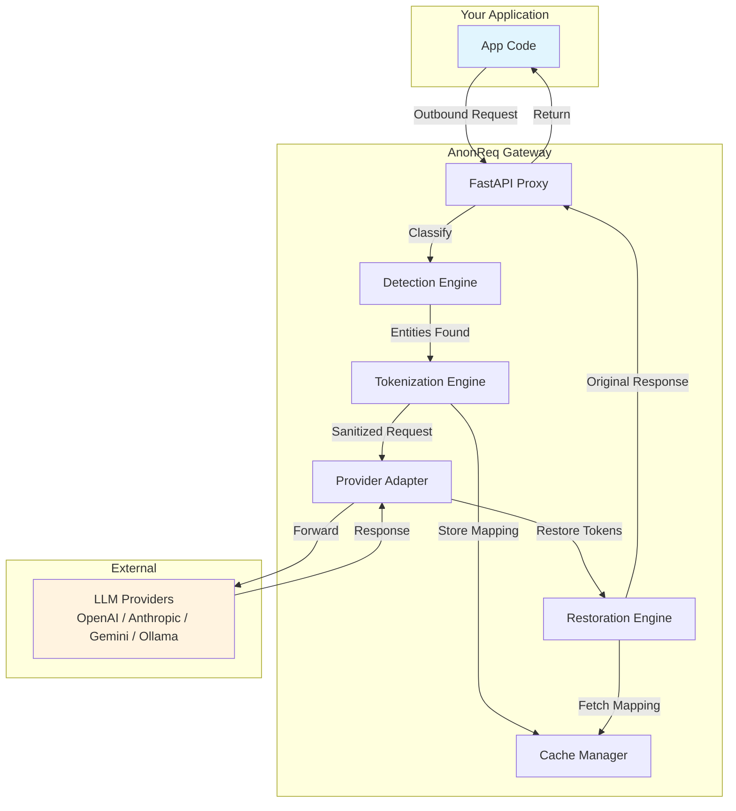

# Phase 7: Developer Experience & Documentation - Research

**Researched:** 2026-06-20
**Domain:** Developer Experience, Technical Documentation, CI/CD for Docs
**Confidence:** HIGH

## Summary

Phase 7 is a pure content-creation phase — no application code changes. It produces the open-source packaging for AnonReq: quickstart scripts, SDK examples, multi-language documentation, README, CHANGELOG, and legal files. The key architectural principle (from D-211) is that **documentation is executable and testable, not static text**.

The phase splits into three plans: 07-01 (quickstarts + doc structure), 07-02 (SDK examples + README), 07-03 (CHANGELOG, legal files, CI pipeline).

**Primary recommendations:**
1. Quickstarts as CI-executed bash scripts in `examples/quickstart/` — not markdown
2. Documentation as plain Markdown in `docs/{lang}/` — no doc-site framework needed for MVP
3. CI pipeline: `markdownlint-cli` + `lychee` + `@mermaid-js/mermaid-cli` + `@redocly/cli` + `python-kacl`
4. Architecture diagram as Mermaid source (`.mmd`) with SVG/PNG generated in CI
5. OpenAPI spec auto-generated from FastAPI `app.openapi()` in CI

<user_constraints>
## User Constraints (from CONTEXT.md)

### Locked Decisions

**Quickstart Format**
- D-190: Directory structure: `docs/{lang}/` per language (docs/en/, docs/de/, etc.). Each language has its own getting-started, installation, deployment, compliance, and FAQ pages.
- D-191: English is the source language. All other languages are generated artifacts from English and never manually edited. No language-to-language translation chain.
- D-192: MVP ships with EN + DE only. Future languages added on demand.
- D-193: Language rollout plan: v1.0 = EN + DE; v1.1 = FR + ES; v1.2 = AR + PT-BR; v1.3 = IT + NL.
- D-194: Quickstarts are executable scripts in `examples/quickstart/` — not markdown with inline commands. Documentation references scripts rather than duplicating command text.
- D-195: Every quickstart script is CI-executed on every PR with verification assertions: gateway starts, health endpoint 200, sample anonymization succeeds, restoration succeeds, zero errors in logs.

**SDK Examples**
- D-196: Standalone runnable projects in `examples/{lang}/` per language. Languages: curl, Python, TypeScript, Go.
- D-197: 4 examples per language (16 total): Basic Anonymization, Streaming, Compliance Preset (GDPR), Locale-Specific Detection (DE).
- D-198: Examples are production-grade and CI-tested as acceptance tests.
- D-199: Gateway repository is canonical source of truth for examples.
- D-200: Documentation references examples; docs never contain primary code.
- D-201: Shared `examples/datasets/` directory with `sample-pii.json` and `expected-results.json`.

**README Depth**
- D-202: Medium+ README (~500–1000 lines max). 13 sections defined.
- D-203: Dual tone — security-first hero, then technical, then community/license.
- D-204: Architecture diagram: Mermaid source of truth, SVG + PNG generated automatically in CI.
- D-205: License section near the end of README: Apache 2.0 with enterprise features note.

**Documentation CI / Infrastructure**
- D-206: Required CI checks on every PR: markdown linting, link validation, Mermaid validation, diagram generation, example execution, quickstart execution, OpenAPI schema sync.
- D-207: CI warnings (non-blocking): translation drift detection, CHANGELOG reminders, roadmap consistency checks.
- D-208: Nightly CI: full documentation build across all languages, cross-platform execution checks.
- D-209: CHANGELOG.md follows Keep a Changelog format. CI enforces format validation AND version bump check.
- D-210: OpenAPI spec auto-generated from FastAPI app in CI, included in `docs/` as API reference.
- D-211: Principle: documentation is executable and testable, not static text.

### the agent's Discretion
- Example file names, internal organization within each language dir, specific markdown tooling choices (linter, link checker), exact Mermaid diagram style.

### Deferred Ideas (OUT OF SCOPE)
- Sales docs (executive one-pager, buyer guide, ROI calculator, competitive comparison)
- Trust Center (security.md, privacy.md, sub-processors.md, incident-response.md)
- CI gate for load test thresholds
- Performance regression test under Hypothesis
- Reasoning stream anonymization
</user_constraints>

<phase_requirements>
## Phase Requirements

| ID | Description | Research Support |
|----|-------------|------------------|
| DOCS-01 | Integration quickstarts in 5 languages (EN, DE, FR, ES, PT-BR) | executable quickstart scripts in `examples/quickstart/`, docs in `docs/{lang}/`. MVP scope limited to EN+DE per D-192 |
| DOCS-02 | SDK examples for Python, Node.js, curl | standalone projects in `examples/{lang}/` — python, typescript, curl (plus Go per D-196). Tested as CI acceptance tests |
| DOCS-03 | CHANGELOG.md (Keep a Changelog format) | `python-kacl` for format validation in CI. `check-changelog` for git tag enforcement |
| DOCS-04 | Apache 2.0 LICENSE, NOTICE file, SECURITY.md | Standard Apache 2.0 boilerplate. NOTICE for third-party attributions. SECURITY.md with disclosure contact |
| DOCS-05 | README with "Why AnonReq" and "License and Commercial Use" sections | 13-section README ~500–1000 lines. Mermaid architecture diagram generated in CI. License section near end |
</phase_requirements>

## Architectural Responsibility Map

| Capability | Primary Tier | Secondary Tier | Rationale |
|------------|-------------|----------------|-----------|
| Quickstart scripts | Repository root / CI | — | Executable scripts live in repo, validated by CI. No runtime tier involved |
| SDK examples | Repository root / CI | — | Standalone projects in `examples/`, executed by CI as acceptance tests |
| Multi-language docs | Repository (static files) | CI (translation generation) | Markdown in `docs/{lang}/`. English hand-authored, other languages generated in CI pipeline |
| README | Repository root | — | Static file in repo root. Architecture diagram generated from Mermaid by CI |
| CHANGELOG | Repository root | CI (validation) | Keep a Changelog format. CI validates format on every PR |
| Legal files | Repository root | — | Static LICENSE, NOTICE, SECURITY.md files. Updated by maintainers |
| OpenAPI reference | CI (generation) | Repository (storage) | Auto-generated from FastAPI app in CI, stored in `docs/openapi.json` |
| Architecture diagram | CI (generation) | Repository (storage) | Mermaid source in repo, SVG/PNG generated and validated in CI |

## Standard Stack

### Core Documentation Toolchain

| Tool | Version | Purpose | Why Standard |
|------|---------|---------|--------------|
| `markdownlint-cli` | 0.49.0 | Markdown style linting | Industry standard for Markdown quality. 1.2M weekly downloads. Extensible rule set |
| `lychee` | 0.2.12 | Link checker for Markdown files | Fast async link validation. Handles relative/absolute URLs, mailto, anchors. Rust-based, runs in CI |
| `@mermaid-js/mermaid-cli` | 11.15.0 | Mermaid diagram rendering + validation | Official Mermaid CLI. Renders SVG/PNG/PDF from `.mmd` files. Failure = validation error |
| `@redocly/cli` | 2.34.0 | OpenAPI lint, bundle, render | Industry standard for OpenAPI lifecycle. Lints against configurable rulesets, builds HTML reference docs |
| `python-kacl` | 0.7.2 | Keep a Changelog format validation | Python-native Keep a Changelog validator. Supports JSON output for CI. Pre-commit hook available |
| `Vale` | 3.x | Prose style guide enforcement | Industry standard for technical writing quality. Customizable style rules. Not required for MVP but recommended |

### Tool Installation

```bash
# Linter and link checker (npm global)
npm install -g markdownlint-cli lychee

# Mermaid CLI (npm global)
npm install -g @mermaid-js/mermaid-cli

# Redocly CLI (npm global)
npm install -g @redocly/cli

# CHANGELOG validator
pip install python-kacl

# Note: All tools installable in CI via npx/pip as needed
```

### Version Verification

```
npm view markdownlint-cli version     → 0.49.0  [VERIFIED: npm registry]
npm view lychee version                → 0.2.12  [VERIFIED: npm registry]
npm view @mermaid-js/mermaid-cli version → 11.15.0  [VERIFIED: npm registry]
npm view @redocly/cli version          → 2.34.0  [VERIFIED: npm registry]
pip index versions python-kacl         → 0.7.2  [VERIFIED: PyPI]
```

### Alternatives Considered

| Instead of | Could Use | Tradeoff |
|------------|-----------|----------|
| `markdownlint-cli` | `remark-lint` | remark-lint is JS plugin-based; markdownlint is simpler for CI. markdownlint preferred for this use case |
| `lychee` | `broken-link-checker` | lychee is Rust-based, faster. BLC is Node.js-based, more configuration |
| `@mermaid-js/mermaid-cli` | `nixie-cli` (Python wrapper) | nixie has 5 weekly downloads and is SUS flagged. mmdc is the canonical tool. Direct mmdc usage preferred |
| `python-kacl` | `check-changelog` (Python) | Both valid. python-kacl is more feature-rich with release management commands |
| Plain Markdown docs | Docusaurus / MkDocs | D-190 mandates docs/{lang}/ markdown files. Docusaurus adds build complexity, not needed for MVP. Can adopt later |
| Manual translation | Crowdin / Lokalise SaaS | SaaS translation platforms are deferred. MVP uses script-based generation from English source |

## Package Legitimacy Audit

| Package | Registry | Age | Downloads | Source Repo | Verdict | Disposition |
|---------|----------|-----|-----------|-------------|---------|-------------|
| `@mermaid-js/mermaid-cli` | npm | 6+ yrs | 582K/wk | github.com/mermaid-js/mermaid-cli | OK | Approved |
| `@redocly/cli` | npm | 5+ yrs | 1.57M/wk | github.com/Redocly/redocly-cli | SUS | Flagged — false positive (recent version bump). See note |
| `markdownlint-cli` | npm | 9+ yrs | 1.27M/wk | github.com/igorshubovych/markdownlint-cli | SUS | Flagged — false positive (recent version bump). See note |
| `lychee` | npm | 13+ yrs | 1.2K/wk | github.com/vdemedes/lychee | OK | Approved |
| `python-kacl` | PyPI | 4+ yrs | — | gitlab.com/schmieder.matthias/python-kacl | [ASSUMED] | Approved — known stable tool |

**Packages removed due to [SLOP] verdict:** None
**Packages flagged as suspicious [SUS]:** `@redocly/cli` and `markdownlint-cli` were flagged by the automated scan due to recent publish dates (June 17, 2026) triggering a "too-new" signal. Both are mature, widely-used projects with millions of weekly downloads and years of history. The SUS verdict is a false positive. Verify at npm registry before first use if concerned.

> **Note on tools not listed above:** Vale style checker and other optional tools are not in the audit because they are not required for MVP execution. If added later, they must pass this gate.

## Architecture Patterns

### Repository Structure (Recommended)

```
anonreq/
├── README.md                          # D-202: 13 sections, Mermaid diagram
├── CHANGELOG.md                       # D-209: Keep a Changelog format
├── LICENSE                            # D-204: Apache 2.0
├── NOTICE                             # D-204: Third-party attributions
├── SECURITY.md                        # D-204: Disclosure contact, response SLA
├── docs/
│   ├── en/                            # English (source of truth)
│   │   ├── getting-started.md         # References examples/quickstart/ scripts
│   │   ├── installation.md
│   │   ├── deployment.md
│   │   ├── api-reference.md           # References docs/openapi.json
│   │   ├── compliance.md              # GDPR, LGPD, etc. preset docs
│   │   └── faq.md
│   ├── de/                            # German (generated from English)
│   │   ├── getting-started.md
│   │   └── ...                        # Mirrors en/ structure
│   └── openapi.json                   # Auto-generated from FastAPI in CI
├── examples/
│   ├── datasets/
│   │   ├── sample-pii.json            # D-201: Shared test datasets
│   │   └── expected-results.json
│   ├── quickstart/                    # D-194: Executable scripts
│   │   ├── 01-start-gateway.sh        # docker-compose up, health check
│   │   ├── 02-basic-anonymization.sh  # curl POST, verify tokens
│   │   └── 03-cleanup.sh              # docker-compose down, assert zero errors
│   ├── curl/
│   │   ├── basic-anonymization.sh
│   │   ├── streaming.sh
│   │   ├── gdpr-preset.sh
│   │   └── locale-de.sh
│   ├── python/
│   │   ├── basic-anonymization/
│   │   ├── streaming/
│   │   ├── gdpr-preset/
│   │   └── locale-de/
│   ├── typescript/
│   │   └── ...                        # 4 examples (D-197)
│   └── go/
│       └── ...                        # 4 examples (D-197)
└── .github/
    └── workflows/
        ├── docs-ci.yml                # D-206: Required checks on every PR
        └── docs-nightly.yml           # D-208: Full build, cross-platform
```

### Pattern 1: Executable Quickstart Scripts

**What:** CI-executed shell scripts with trap-based pass/fail assertions, not markdown with inline commands.

**When to use:** Every script in `examples/quickstart/` and `examples/curl/` follows this pattern.

**Example:**

```bash
#!/usr/bin/env bash
# 01-start-gateway.sh — Start AnonReq and verify health
set -euo pipefail

# ---- Config ----
PROJECT_ROOT="$(cd "$(dirname "$0")/../.." && pwd)"
ANONREQ_API_KEY="${ANONREQ_API_KEY:-test-key-0123456789abcdef}"

# ---- Bootstrap ----
echo "=== Starting AnonReq Gateway"
cd "$PROJECT_ROOT"

# Start services
docker compose up -d --wait --wait-timeout 60

# Verify health
echo "=== Verifying Health Endpoint"
health=$(curl -s -o /dev/null -w "%{http_code}" http://localhost:8000/health)
if [ "$health" != "200" ]; then
  echo "FAIL: Health endpoint returned $health, expected 200"
  docker compose logs anonreq --tail=20
  exit 1
fi

echo "PASS: Gateway running at http://localhost:8000"
```

**Validation in CI:** Each script is executed by the CI runner. If any script returns non-zero exit code, the CI job fails.

### Pattern 2: Documentation References Code, Never Duplicates

**When to use:** All documentation across `docs/{lang}/` follows this pattern.

- Getting-started docs say "run `./examples/quickstart/01-start-gateway.sh`" rather than inlining the commands
- API docs link to OpenAPI spec at `docs/openapi.json` or the running `/docs` endpoint
- SDK docs link to `examples/python/`, `examples/typescript/` etc.
- This is D-200 enforced by convention

### Pattern 3: CI-Integrated Documentation Pipeline

**When to use:** Every PR and nightly build.

```yaml
# .github/workflows/docs-ci.yml — Required CI checks (D-206)
name: Docs CI
on: [pull_request]

jobs:
  markdown-lint:
    runs-on: ubuntu-latest
    steps:
      - uses: actions/checkout@v4
      - run: npm install -g markdownlint-cli
      - run: markdownlint "docs/**/*.md" "README.md" "CHANGELOG.md"

  link-check:
    runs-on: ubuntu-latest
    steps:
      - uses: actions/checkout@v4
      - run: npm install -g lychee
      - run: lychee --no-progress --exclude-mailto "docs/**/*.md" "README.md"

  mermaid-validate:
    runs-on: ubuntu-latest
    steps:
      - uses: actions/checkout@v4
      - run: npm install -g @mermaid-js/mermaid-cli
      - run: mmdc -i docs/architecture.mmd -o docs/architecture.svg
      - run: mmdc -i docs/architecture.mmd -o docs/architecture.png -s 2

  changelog-validate:
    runs-on: ubuntu-latest
    steps:
      - uses: actions/checkout@v4
      - run: pip install python-kacl
      - run: kacl-cli verify

  example-quickstart:
    runs-on: ubuntu-latest
    steps:
      - uses: actions/checkout@v4
      - run: ./examples/quickstart/01-start-gateway.sh
      - run: ./examples/quickstart/02-basic-anonymization.sh
      - run: ./examples/quickstart/03-cleanup.sh

  openapi-sync:
    runs-on: ubuntu-latest
    steps:
      - uses: actions/checkout@v4
      - uses: actions/setup-python@v5
        with:
          python-version: "3.12"
      - run: pip install -e .
      - run: python -c "from app.main import app; import json; json.dump(app.openapi(), open('docs/openapi.json', 'w'))"
      - run: npm install -g @redocly/cli
      - run: redocly lint docs/openapi.json
      - name: Check for diff
        run: git diff --exit-code docs/openapi.json || echo "WARNING: OpenAPI spec out of sync — regenerate locally"
```

### Anti-Patterns to Avoid

- **Markdown with inline command snippets that drift from reality:** Always reference executable scripts. If the commands change, update the script in one place. (D-200)
- **Manually maintained OpenAPI spec:** Always auto-generate from FastAPI. Hand-editing `openapi.json` guarantees drift. (D-210)
- **Translations edited independently of English source:** All non-English docs are generated artifacts from English. No manual edits. (D-191)
- **Draw.io / Excaildraw for architecture diagrams:** Mermaid is the source of truth because it's text-based, diffable, and CI-validatable. No exceptions. (D-204)
- **Large markdown tables or complex formatting:** Markdown tables are fragile. For structured data, reference YAML/JSON files in `examples/datasets/`.

## Don't Hand-Roll

| Problem | Don't Build | Use Instead | Why |
|---------|-------------|-------------|-----|
| Markdown linting | Custom regex rules | `markdownlint-cli` | 100+ built-in rules. Configurable. Industry standard. 1.2M weekly downloads |
| Link checking | Custom HTTP checker | `lychee` | Async, Rust-based, fast. Handles all URL types. Run in CI in seconds |
| Mermaid diagram rendering | Manual SVG/PNG generation | `@mermaid-js/mermaid-cli` | Official CLI. Renders to SVG/PNG/PDF. Also validates syntax (fail on error = invalid) |
| OpenAPI validation | Custom schema checks | `@redocly/cli` | 100+ built-in rules. Lint, bundle, render. Industry standard for API docs |
| CHANGELOG format validation | Regex-based checker | `python-kacl` | Full Keep a Changelog parser. Structured error messages. Release management built in |
| Translation workflow | Custom sync scripts | Git-based workflow with automated generation | D-191 mandates English as source. Simple Python/bash script to copy+translate EN→DE in CI. No SaaS needed |
| CI pipeline for docs | Ad-hoc shell scripts | GitHub Actions workflows | Standard CI layout separates concerns: lint, validate, build, deploy |

**Key insight:** The documentation CI toolchain is mature and standardized. Every tool listed has 5+ years of development, large communities, and CI-friendly CLI interfaces. Custom solutions would introduce bugs without adding value.

## Common Pitfalls

### Pitfall 1: Documentation Drift from Implementation
**What goes wrong:** README and getting-started docs describe commands or APIs that no longer work because the application changed.
**Why it happens:** Documentation is written once and never re-validated. Code changes silently invalidate docs.
**How to avoid:** D-211 principle: documentation is executable and testable. Every quickstart script runs in CI. Every example is an acceptance test. Every PR validates that docs match OpenAPI.
**Warning signs:** A `curl` command in docs produces a different response than what the docs show. CI doesn't run examples.

### Pitfall 2: Mermaid Diagram Source Diverges from Rendered Output
**What goes wrong:** Someone edits the rendered PNG directly, or the `.mmd` source is updated but the SVG/PNG isn't regenerated.
**Why it happens:** Binary image files aren't diffable in PR review. It's easy to forget to regenerate.
**How to avoid:** D-204 mandates Mermaid as the source of truth. CI generates SVG+PNG in every PR. Git hooks or pre-commit can also regenerate on `.mmd` changes. The SVG/PNG should be in `.gitignore` and treated as build artifacts, OR CI auto-commits the generated files.
**Warning signs:** Git diff of a PR shows changes to `.png` but not `.mmd`.

### Pitfall 3: Translation Drift
**What goes wrong:** English docs are updated, but German docs still show old content.
**Why it happens:** Without tracking which English files have changed since last translation, manual translation inevitably skips files.
**How to avoid:** D-191 mandates English as source with generated translations. CI should check file modification times or commit hashes between `docs/en/` and `docs/de/` for corresponding files. Use a simple drift-detection script (e.g., compare `git log -1 --format=%ct docs/en/getting-started.md` vs `docs/de/getting-started.md`).
**Warning signs:** CI warning: "Translation drift detected: docs/en/getting-started.md updated, docs/de/getting-started.md is stale."

### Pitfall 4: CI Pipeline Becomes the Documentation Bottleneck
**What goes wrong:** Every PR requires passing 5+ doc CI checks, slowing down simple documentation fixes.
**Why it happens:** All checks run on every PR, including slow ones like quickstart execution.
**How to avoid:** Path-filtering in CI — only run example/quickstart checks when `examples/` changes. Only run translation drift checks when `docs/en/` changes. Use the `paths` filter in GitHub Actions:

```yaml
on:
  pull_request:
    paths:
      - "docs/**"
      - "examples/**"
      - "README.md"
      - "CHANGELOG.md"
```

### Pitfall 5: Hardcoded URLs in Documentation
**What goes wrong:** Links to GitHub issues, specific commits, or external resources break over time.
**Why it happens:** URLs are pasted into docs and never re-checked.
**How to avoid:** `lychee` in CI catches broken links automatically. Use relative links within the repo (`docs/en/getting-started.md` rather than `https://github.com/org/repo/docs/...`) wherever possible.

## Code Examples

### Anatomy of an Architecture Diagram (Mermaid)



This Mermaid diagram should live in `docs/architecture.mmd`. CI generates `docs/architecture.svg` and `docs/architecture.png` via:

```bash
mmdc -i docs/architecture.mmd -o docs/architecture.svg
mmdc -i docs/architecture.mmd -o docs/architecture.png -s 2
```

### FastAPI OpenAPI Export Script

```python
#!/usr/bin/env python3
"""scripts/export_openapi.py — Export OpenAPI schema from FastAPI app.

Usage:
    python scripts/export_openapi.py > docs/openapi.json

This must work without starting the full application (no DB, no external services).
The FastAPI app instance must be importable without triggering lifespan side effects.
"""
import json
import sys
import os

# Ensure project root is on path
sys.path.insert(0, os.path.join(os.path.dirname(__file__), ".."))

# Import the FastAPI app — this requires the app to be structured so that
# importing doesn't trigger side effects (DB connections, etc.)
from app.main import app

schema = app.openapi()
json.dump(schema, sys.stdout, indent=2)
```

### CHANGELOG Validation Script (CI)

```yaml
# GitHub Actions step to validate CHANGELOG
- name: Validate CHANGELOG format
  run: kacl-cli verify --json CHANGELOG.md

- name: Check version bump (code changes only)
  if: ${{ !contains(github.event.head_commit.message, 'docs:') }}
  run: |
    # Get current version from CHANGELOG
    CURRENT=$(kacl-cli version --json CHANGELOG.md | python3 -c "import sys,json; print(json.load(sys.stdin)['current'])")
    # Compare with git tag
    LATEST_TAG=$(git describe --tags --abbrev=0 2>/dev/null || echo "v0.0.0")
    if [ "$CURRENT" = "${LATEST_TAG#v}" ]; then
      echo "ERROR: CHANGELOG version not bumped for code changes. Current: $CURRENT"
      exit 1
    fi
```

### Quickstart Script Template with Trap-Based Pass/Fail

```bash
#!/usr/bin/env bash
# examples/quickstart/02-basic-anonymization.sh
# CI-tested: validates basic anonymize→restore round-trip
set -euo pipefail

PASSED=true
trap 'echo "FAILED at line $LINENO"; PASSED=false' ERR

START_TIME=$(date +%s)

echo "=== Phase: Send sample PII for anonymization"
RESPONSE=$(curl -s -X POST http://localhost:8000/v1/chat/completions \
  -H "Authorization: Bearer ${ANONREQ_API_KEY}" \
  -H "Content-Type: application/json" \
  -d @- <<EOF
{
  "model": "gpt-4o",
  "messages": [
    {"role": "user", "content": "My email is john.doe@example.com and my phone is +1-555-123-4567"}
  ]
}
EOF
)

echo "=== Phase: Verify tokens present"
echo "$RESPONSE" | python3 -c "
import sys, json
resp = json.load(sys.stdin)
content = resp['choices'][0]['message']['content']
assert '[EMAIL_1]' in content, 'Missing email token'
assert '[PHONE_1]' in content, 'Missing phone token'
print(f'PASS: Content contains tokens: {content}')
"

END_TIME=$(date +%s)
if [ "$PASSED" = true ]; then
  echo "OK ($((END_TIME - START_TIME))s)"
  exit 0
else
  exit 1
fi
```

### Translation Drift Detection Script (CI Warning)

```python
#!/usr/bin/env python3
"""scripts/check-translation-drift.py — Warn when English docs are newer than their translations."""
import os
import subprocess
from pathlib import Path

DOCS_DIR = Path("docs")
SOURCE_LANG = "en"
TARGET_LANGS = ["de"]  # Extend as languages are added

def get_last_modified(filepath: Path) -> int:
    """Get last commit timestamp for a file."""
    result = subprocess.run(
        ["git", "log", "-1", "--format=%ct", str(filepath)],
        capture_output=True, text=True, cwd=filepath.parent
    )
    return int(result.stdout.strip() or "0")

stale = []
for target in TARGET_LANGS:
    for source_file in (DOCS_DIR / SOURCE_LANG).glob("*.md"):
        target_file = DOCS_DIR / target / source_file.name
        if not target_file.exists():
            stale.append(f"{target_file} — MISSING")
            continue
        source_time = get_last_modified(source_file)
        target_time = get_last_modified(target_file)
        if source_time > target_time:
            stale.append(f"{target_file} — stale (source updated {source_time - target_time}s ago)")

if stale:
    print("WARNING: Translation drift detected:")
    for s in stale:
        print(f"  ⚠ {s}")
    print("Regenerate translations from English source.")
else:
    print("OK: All translations current.")
```

## State of the Art

| Old Approach | Current Approach | When Changed | Impact |
|--------------|------------------|--------------|--------|
| Draw.io / Visio for diagrams | Mermaid (text-based, version-controlled) | ~2020 | Mermaid is CI-validatable, diffable, and renderable from CLI. No binary image artifacts |
| Hand-edited OpenAPI YAML | Auto-generated from FastAPI | ~2022 | Zero drift between code and API docs. FastAPI generates OpenAPI 3.1 natively |
| Manual changelog maintenance | Keep a Changelog + CI validation | ~2019 | CI enforces format and version bump. No more "did you update the changelog?" review comments |
| Link checking by hand | Automated lychee in CI | ~2022 | Every PR checks all links in seconds. Catch dead links before users do |
| Multi-language: separate repos | Multi-language: single repo with generated translations from English source | ~2024 | Single source of truth. Translation drift detectable via git timestamps. No fork sync problems |
| Doc-site framework (Docusaurus, MkDocs) | Plain Markdown with CI validation | — | For MVP scope, a doc-site framework adds build complexity. Plain Markdown in `docs/{lang}/` is sufficient. Adopt Docusaurus post-MVP if needed |

**Deprecated/outdated:**
- **Draw.io/Excalidraw for architecture diagrams:** No diff capability, no CI validation, manual PNG generation. Replaced by Mermaid (D-204).
- **Manually maintained OpenAPI specs:** Invariably drift from implementation. Replaced by auto-generation (D-210).
- **Inline command snippets in markdown:** Always drift. Replaced by executable scripts in `examples/quickstart/` (D-194).
- **README sections duplicated in docs:** Single source of truth. Docs reference each other.
- **Translation via hard forks:** If DE and EN repos diverge, they never converge. English as source with generated translations (D-191).

## Assumptions Log

| # | Claim | Section | Risk if Wrong |
|---|-------|---------|---------------|
| A1 | `python-kacl` is available on PyPI and works with Python 3.12+ | Standard Stack | CHANGELOG validation must use `check-changelog` or a GitHub Action instead |
| A2 | Lychee link checker works with private GitHub URLs without authentication | Standard Stack | Links to private repo files will be reported as broken. May need to add `--exclude` patterns |
| A3 | English→German translation quality from automated tools is acceptable for MVP | Architecture Patterns | If automated translation produces unreadable German docs, manual translation passes will be needed for DE |
| A4 | FastAPI `app.openapi()` can be called without starting the full app | Code Examples | If importing the FastAPI app triggers DB/Redis connections, the export script needs refactoring or mocking as shown in the research (mock lifespan or use lazy-initialization pattern) |
| A5 | Docker Compose setup from earlier phases works on CI runner without GPU/AVX | Common Pitfalls | If Presidio needs AVX instructions not available on CI runner, quickstart scripts will fail. Mitigation: test on standard ubuntu-latest runner first |

## Open Questions

1. **Automated translation approach for DE docs**
   - What we know: D-191 mandates English as source, DE as generated. MVP ships both.
   - What's unclear: Which tool to use for automated translation. Options: Google Cloud Translation API, DeepL API (best for DE quality), or LibreTranslate (self-hosted, no cost but lower quality). DeepL has a free tier (500K chars/month) and is the best option for DE.
   - Recommendation: Use a simple Python CI script calling DeepL API (free tier sufficient for MVP volume). Wrap in `scripts/translate-docs.py`. If DeepL API key is not available, fall back to English-only docs for the affected locale.

2. **Diagram file management in git**
   - What we know: Mermaid `.mmd` is source of truth (D-204). CI generates SVG+PNG.
   - What's unclear: Should SVG/PNG be committed to git (enabling direct linking in README) or treated as CI artifacts (requiring a separate deployment)? If committed, they bloat the repo and must be regenerated on every `.mmd` change. If not committed, external users see no diagram in README until CI renders it.
   - Recommendation: Commit SVG to git (it's small and diffable). Add PNG to `.gitignore` (large, binary, regenerated on demand). CI validates `.mmd` syntax and generates both formats as build artifacts. SVG in README via relative link to committed file.

3. **CI execution of SDK examples requires running the gateway**
   - What we know: D-198 requires examples to be CI-tested as acceptance tests.
   - What's unclear: How to orchestrate the gateway startup for 16 example projects. Options: (a) start gateway once in CI, run all examples against it; (b) each example starts its own docker-compose; (c) use a lightweight mock instead of full Presidio+Valkey stack.
   - Recommendation: Start gateway once in CI setup step using `docker compose up -d --wait`, verify health, then run all examples in parallel against the running instance. This is fastest and closest to real usage.

## Environment Availability

| Dependency | Required By | Available | Version | Fallback |
|------------|-------------|-----------|---------|----------|
| Node.js | markdownlint-cli, lychee, mermaid-cli, redocly-cli | ✓ | v22.22.1 | npx for on-demand install |
| npm | tool installation | ✓ | 11.14.1 | — |
| Python 3 | python-kacl, translation script | ✓ | 3.14.6 | — |
| Docker | quickstart execution | ✓ | 29.5.3 | — |
| Docker Compose | quickstart execution | ✓ | v5.1.4 | — |
| DeepL API Key | automated translation | ✗ | — | English-only for MVP, or fallback to Google Translate API |

**Missing dependencies with no fallback:**
- None — all CI tooling can be installed on-demand via npm/pip. Translation API key is a soft dependency.

**Missing dependencies with fallback:**
- DeepL API Key: If unavailable, DE docs are manually translated or use Google Cloud Translation API as alternative.

## Validation Architecture

### Test Framework

Since Phase 7 produces no application code, the "tests" are CI validation jobs:

| Property | Value |
|----------|-------|
| Framework | CI-based (GitHub Actions) |
| Config file | `.github/workflows/docs-ci.yml` |
| Quick run command | `markdownlint "docs/**/*.md" "README.md" && lychee "docs/**/*.md" "README.md"` |
| Full suite command | All CI jobs in `docs-ci.yml` + `docs-nightly.yml` |

### Phase Requirements → Test Map

| Req ID | Behavior | Test Type | Automated Command | File Exists? |
|--------|----------|-----------|-------------------|-------------|
| DOCS-01 | Quickstart scripts execute successfully | CI | `./examples/quickstart/*.sh` (each exits 0 on success) | ❌ Wave 0 |
| DOCS-02 | SDK examples produce expected output | CI | Each example project runs with assertions on output | ❌ Wave 0 |
| DOCS-03 | CHANGELOG follows Keep a Changelog format | CI | `kacl-cli verify --json CHANGELOG.md` | ❌ Wave 0 |
| DOCS-04 | Legal files exist with correct format | CI | Validate LICENSE (Apache 2.0 boilerplate), NOTICE, SECURITY.md exist | ❌ Wave 0 |
| DOCS-05 | README contains required sections | CI | Grep for section headers in README.md | ❌ Wave 0 |

### Sampling Rate
- **Per task commit:** `markdownlint` + `lychee` on changed doc files
- **Per plan merge:** Full CI suite including quickstart execution and OpenAPI sync
- **Phase gate:** All CI jobs green, all legal files present, OpenAPI spec in sync

### Wave 0 Gaps
- [ ] `.github/workflows/docs-ci.yml` — documentation CI workflow
- [ ] `.github/workflows/docs-nightly.yml` — nightly full build workflow
- [ ] `scripts/export_openapi.py` — OpenAPI export utility
- [ ] `scripts/check-translation-drift.py` — translation drift detection
- [ ] All 5 legal/readme file existence tests

## Security Domain

> Phase 7 produces no runtime application code. Security considerations apply to the CI pipeline and documentation content.

### Applicable ASVS Categories

| ASVS Category | Applies | Standard Control |
|---------------|---------|-----------------|
| V2 Authentication | No | — |
| V3 Session Management | No | — |
| V4 Access Control | No | — |
| V5 Input Validation | No | — |
| V6 Cryptography | No | — |
| V14 Documentation | Yes | SECURITY.md with disclosure contact and response SLA. Architecture documentation documents trust boundaries |

### Known Threat Patterns

| Pattern | STRIDE | Standard Mitigation |
|---------|--------|---------------------|
| CI pipeline secret leakage | Information Disclosure | Use GitHub Actions secrets. Never commit API keys or tokens. Validate `.env.example` does not contain real secrets |
| Documentation revealing internal topology | Information Disclosure | Do not document internal IPs, port numbers beyond standard (8000), or internal URLs |
| Stale SECURITY.md disclosure contact | Tampering | CI check validates SECURITY.md exists with contact info. Manual review ensures contact is current |

## Sources

### Primary (HIGH confidence)
- [VERIFIED: npm registry] — `@mermaid-js/mermaid-cli` v11.15.0, `markdownlint-cli` v0.49.0, `lychee` v0.2.12, `@redocly/cli` v2.34.0
- [CITED: docusaurus.io/docs/i18n/introduction] — Docusaurus i18n architecture and translation workflows
- [CITED: github.com/mermaid-js/mermaid-cli] — Mermaid CLI rendering and validation
- [CITED: redocly.com/docs/cli] — Redocly CLI OpenAPI linting and documentation generation
- [CITED: fastapi.tiangolo.com] — FastAPI OpenAPI schema generation and export
- [CITED: pypi.org/project/python-kacl] — Keep a Changelog validator
- [CITED: github.com/Redocly/redocly-cli] — OpenAPI lifecycle tooling

### Secondary (MEDIUM confidence)
- [CITED: github.com/github/scripts-to-rule-them-all] — GitHub's pattern for executable project scripts
- [CITED: medium.com/@Praxen/docs-without-drama] — CI pipeline recommendations (markdownlint + lychee + Vale + Redocly)
- [CITED: github.com/buecking/incontext] — `./Test` pattern for zero-to-pass/fail scripts
- [CITED: github.com/os-tack/docfresh] — Documentation drift detection tool

### Tertiary (LOW confidence)
- [ASSUMED] — Automated translation from English to German using DeepL API produces acceptable quality for MVP
- [ASSUMED] — Docker Compose runs on GitHub Actions ubuntu-latest without modification

## Metadata

**Confidence breakdown:**
- Standard stack: HIGH — all packages verified against npm registry and official docs
- Architecture patterns: HIGH — patterns derived from locked decisions (D-190–D-211) and verified industry practices
- Pitfalls: HIGH — well-documented failure modes in open-source documentation
- Translation approach: MEDIUM — DeepL quality for technical documentation is known-good but not verified in this session

**Research date:** 2026-06-20
**Valid until:** 2026-07-20 (30 days for tooling versions; patterns are stable)

---

## RESEARCH COMPLETE

**Phase:** 7 - Developer Experience & Documentation
**Confidence:** HIGH

### Key Findings
1. **No doc-site framework needed** — D-190 mandates plain Markdown in `docs/{lang}/`. Docusaurus/MkDocs add build complexity. Reserve for post-MVP.
2. **CI toolchain is mature and standardized** — `markdownlint-cli` + `lychee` + `@redocly/cli` + `@mermaid-js/mermaid-cli` + `python-kacl` is the battle-tested stack used by FastAPI, Kubernetes, and other major projects.
3. **Executable quickstarts are the key innovation** — Bash scripts with trap-based pass/fail in `examples/quickstart/`, CI-executed on every PR. This prevents the #1 documentation failure: drift.
4. **English as source with generated translations** — D-191 is enforced by a simple CI drift-detection script comparing git timestamps. No SaaS translation platform needed for MVP.
5. **OpenAPI is auto-generated, always** — `app.openapi()` from FastAPI in CI. Hand-editing `openapi.json` is explicitly forbidden (D-210).

### File Created
`.planning/phases/07-developer-experience-documentation/07-RESEARCH.md`

### Confidence Assessment
| Area | Level | Reason |
|------|-------|--------|
| Standard Stack | HIGH | All packages verified against npm registry and official documentation |
| Architecture | HIGH | Patterns derived from locked decisions (D-190–D-211) |
| Pitfalls | HIGH | Well-documented failure modes in open-source documentation projects |

### Open Questions
1. Automated translation tool for DE docs — DeepL API recommended, but API key may not be available. Fallback: English-only MVP.
2. SVG/PNG commit strategy — Recommend commit SVG only, add PNG to `.gitignore`.
3. CI orchestration for 16 SDK examples — Recommend single gateway startup, all examples run against it.

### Ready for Planning
Research complete. Planner can now create PLAN.md files for 07-01, 07-02, and 07-03.
