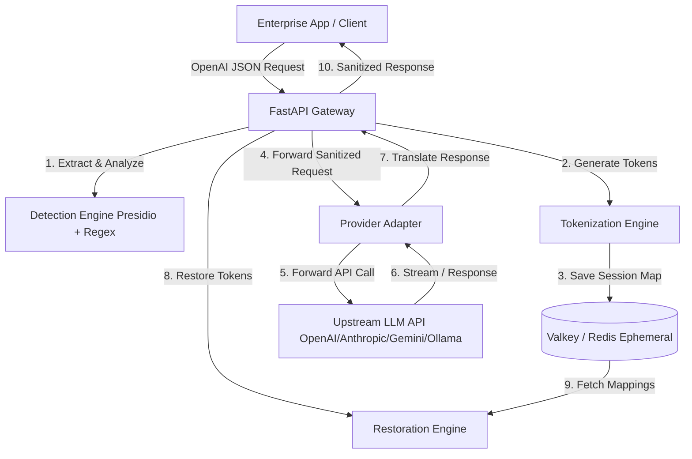

# AnonReq Gateway

AnonReq is a self-hosted, high-performance anonymization gateway designed to sit between enterprise applications and external LLM APIs (e.g., OpenAI, Anthropic, Gemini, Ollama). It intercepts outbound requests, automatically detects and tokenizes Personally Identifiable Information (PII/PHI), forwards sanitized requests to upstream providers, and restores the original PII tokens in the incoming response streams—all completely in-memory, without storing sensitive data on disk.

---

## Key Features & Constraints

- **Fail-Secure Architecture**: If any part of the pipeline fails (e.g., detection, caching, parsing, or timeout), AnonReq immediately aborts the request and returns an HTTP 5xx error to prevent any unsanitized PII from leaking to external LLM APIs.
- **In-Memory & Ephemeral**: Utilizes an ephemeral Valkey/Redis cache with disk persistence disabled (`save ""`, `appendonly no`). Mappings are session-scoped and automatically evicted after response processing or TTL expiry (60s–3600s).
- **Hybrid Detection Pipeline**: Combines high-speed local Regex matchers with Microsoft Presidio Analyzer for deep Named Entity Recognition (NER).
- **Token Restoration**: Restores tokens dynamically in LLM responses, supporting standard and Server-Sent Events (SSE) streaming with a robust Tail Buffer to handle tokens split across multiple chunks.
- **Strict Logging Controls**: Implements structured JSON logging to `stdout`. All raw prompt and response values are completely redacted, keeping logs clean of PII.
- **Provider Adapters**: Exposes an OpenAI-compatible wire protocol while providing translation layers/adapters to target other providers (Anthropic, Gemini, Ollama).
- **Multi-Locale Support**: Leverages the `X-AnonReq-Locale` header to run locale-specific recognizer bundles (supporting 8 locales).
- **Observability**: Exposes `/health` and `/metrics` (Prometheus format) endpoints.

---

## System Architecture



---

## Directory Structure

```text
├── .env.example            # Template for environment configuration
├── .gitignore              # Git ignore configuration
├── Dockerfile              # Multi-stage production Docker build
├── docker-compose.yml      # Local dev orchestration (Gateway + Presidio + Valkey)
├── pyproject.toml          # Build backend and dependencies (managed by uv)
├── req/                    # System requirements documents (PRD, HLD, LLD)
├── src/
│   └── anonreq/
│       ├── config.py       # Configuration management via pydantic-settings
│       ├── dependencies.py # API dependencies (caches, clients)
│       ├── health.py       # Health checks and status monitoring
│       ├── main.py         # FastAPI application entrypoint
│       ├── detection/      # Presidio & Regex pipeline
│       ├── pipeline/       # Core flow stages (tokenization, adapters)
│       ├── providers/      # Downstream provider translation layers
│       ├── routing/        # Model aliases and route selection
│       └── streaming/      # SSE parsing & Tail Buffer logic
└── tests/
    ├── conftest.py         # Pytest fixtures and configs
    ├── integration/        # Integration tests (locales, startup)
    ├── load/               # Concurrency and load testing
    ├── property/           # Property-based tests (Hypothesis)
    └── unit/               # Unit tests (individual components)
```

---

## Getting Started

### Prerequisites
- [Docker](https://www.docker.com/) and Docker Compose
- [Python 3.12](https://www.python.org/downloads/) (for local development)
- [uv](https://github.com/astral-sh/uv) (recommended Python package manager)

### 1. Configuration
Copy the `.env.example` file to `.env` and fill in the configuration details.

```bash
cp .env.example .env
```

Set at least the required keys in `.env`:
- `ANONREQ_API_KEY`: A secure API key (minimum 32 characters) to authenticate clients calling the gateway.
- `ANONREQ_ADMIN_API_KEY`: Optional admin API key for configuration reloading.

### 2. Run with Docker Compose (Recommended)
You can bring up the entire stack (AnonReq Gateway, Valkey, and Presidio Analyzer) with:

```bash
docker-compose up --build
```

The gateway will be exposed at `http://localhost:8080`.

### 3. Local Development (without Docker)
If you prefer to run the components individually:

1. **Install dependencies**:
   ```bash
   uv sync
   ```

2. **Run Valkey/Redis**:
   Ensure you have a Valkey or Redis instance running locally at `redis://localhost:6379/0` (configured with no persistence).

3. **Run Presidio Analyzer**:
   Ensure Presidio is running on `http://localhost:5001`.

4. **Start the API server**:
   ```bash
   uv run uvicorn anonreq.main:app --host 0.0.0.0 --port 8080 --reload
   ```

---

## Testing

AnonReq uses a comprehensive testing strategy combining Unit, Integration, Load, and Property-based tests (Hypothesis).

### Running all tests
```bash
uv run pytest
```

### Running Property-Based Tests
To execute property-based tests verifying round-trip token correctness, streaming tail-buffering, and randomness:
```bash
uv run pytest tests/property/
```

### Running Load Tests
```bash
uv run pytest -m load
```

---

## License

This project is licensed under the Apache License 2.0. See the file metadata or requirement docs for details.
