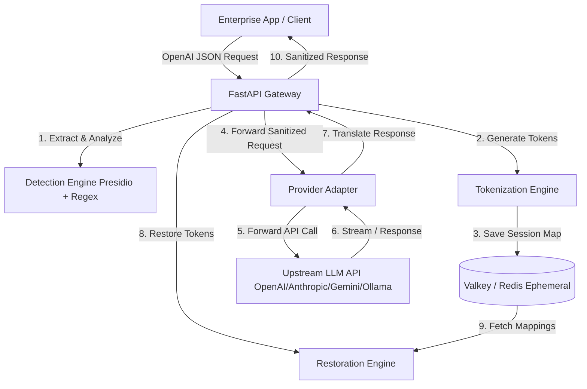

# AnonReq Gateway

AnonReq is a self-hosted, high-performance anonymization gateway designed to sit between enterprise applications and external LLM APIs (e.g., OpenAI, Anthropic, Gemini, Ollama). It intercepts outbound requests, automatically detects and tokenizes Personally Identifiable Information (PII/PHI), forwards sanitized requests to upstream providers, and restores the original PII tokens in the incoming response streams—all completely in-memory, without storing sensitive data on disk.

---

## Key Features & Constraints

- **Fail-Secure Architecture**: If any part of the pipeline fails (e.g., detection, caching, parsing, or timeout), AnonReq immediately aborts the request and returns an HTTP 5xx error to prevent any unsanitized PII from leaking to external LLM APIs.
- **In-Memory & Ephemeral**: Utilizes an ephemeral Valkey/Redis cache with disk persistence disabled (`save ""`, `appendonly no`). Mappings are session-scoped and automatically evicted after response processing or TTL expiry (60s–3600s).
- **Hybrid Detection Pipeline**: Combines high-speed local Regex matchers with Microsoft Presidio Analyzer for deep Named Entity Recognition (NER).
- **Token Restoration**: Restores tokens dynamically in LLM responses, supporting standard and Server-Sent Events (SSE) streaming with a robust Tail Buffer to handle tokens split across multiple chunks.
- **Strict Logging Controls**: Implements structured JSON logging to `stdout`. All raw prompt and response values are completely redacted, keeping logs clean of PII.
- **Provider Adapters**: Exposes an OpenAI-compatible wire protocol while providing translation layers/adapters to target other providers (Anthropic, Gemini, Ollama).
- **Multi-Locale Support**: Leverages the `X-AnonReq-Locale` header to run locale-specific recognizer bundles (supporting 8 locales).
- **Observability**: Exposes `/health` and `/metrics` (Prometheus format) endpoints, SLO engine, and audit chain with export.

---

## Enterprise Features

- **RBAC & Policy Engine**: Role-based access control with PDP/PEP policy decision and enforcement points, YAML-configurable enterprise policies.
- **Compliance Presets**: 6 built-in presets (GDPR, LGPD, PDPA, POPIA, Privacy Act AU, PIPEDA) with per-locale validation and startup checks.
- **DLP & Exfiltration Detection**: Data loss prevention pipeline with content inspection, quarantine, and MITRE ATT&CK mapping.
- **AI Firewall**: Prompt injection detection, jailbreak prevention, and classification (BLOCK / ROUTE_LOCAL / ANONYMIZE / PASS).
- **SOC/SIEM Integration**: Sink adapters for Splunk HEC, Elastic, Sentinel DCR, QRadar CEF, Datadog Logs, and generic webhooks with buffering and health checks.
- **Proxy/TLS/PAC**: Transparent and reverse proxy modes with TLS/MITM inspection, PAC file parsing, and CA management.
- **Endpoint Agent**: Local agent for on-device traffic interception and forwarding.
- **Voice Sanitization**: Real-time voice transcript scanning and PII redaction with STT connector support.
- **Multimodal Scanning**: Image and document scanning for embedded PII using Presidio and custom extractors.
- **RAG Governance**: Retrieval-augmented generation content controls and source validation.
- **CASB Integration**: Cloud access security broker controls for AI traffic.
- **Discovery & Asset Inventory**: Flow analysis, hostname allowlisting, and automated asset cataloging.
- **DSAR & eDiscovery**: Data subject access request handling and eDiscovery export workflows.
- **Breach Management**: Breach detection, notification, and incident classification.
- **Retention & Legal Hold**: Tiered retention policies with legal hold support.
- **Fairness Monitoring**: Bias evaluation with dataset management and fairness metrics.
- **Data Lineage**: Full data flow tracking and lineage records.
- **Trust Center**: Transparency and supplier risk management.
- **MCP Inspector**: Model Context Protocol tool inspection and policy evaluation.
- **Deployment Modes**: Flexible topologies — standalone, Appliance, and multi-tenant configurations.

---

## System Architecture



---

## Directory Structure

```text
├── .env.example                # Template for environment configuration
├── .gitignore                  # Git ignore configuration
├── Dockerfile                  # Multi-stage production Docker build
├── docker-compose.yml          # Local dev orchestration (9 services)
├── pyproject.toml              # Build backend and dependencies (managed by uv)
├── alembic/                    # Database migrations for governance/audit persistence
├── config/                     # YAML configuration files
│   ├── enterprise-policy.yaml  # Enterprise RBAC and policy rules
│   ├── compliance/             # Compliance preset definitions
│   ├── locales/                # Locale-specific recognizer bundles
│   ├── policies/               # Policy rule sets
│   ├── dlp.yaml                # Data loss prevention rules
│   ├── soc-sinks.yaml          # SOC/SIEM sink configuration
│   ├── prompt-security-rules.yaml  # Prompt injection/jailbreak rules
│   ├── model_aliases.yaml      # Model alias routing table
│   ├── providers.yaml          # Provider capability registry
│   └── ...                     # Classification, fairness, slo, etc.
├── data/                       # Runtime data (CA certs, etc.)
├── docker/                     # Docker support files
├── docs/                       # Documentation (EN, DE, FR, ES, IT, NL, PT, AR)
├── examples/                   # Quickstart scripts and SDK examples
│   ├── curl/
│   ├── python/
│   ├── typescript/
│   ├── go/
│   ├── datasets/
│   └── quickstart/
├── openapi/                    # Generated OpenAPI specification
├── req/                        # System requirements (PRD, HLD, LLD)
├── scripts/                    # Utility scripts
├── src/
│   └── anonreq/
│       ├── __about__.py        # Package version (0.1.0)
│       ├── main.py             # FastAPI application factory and entrypoint
│       ├── config/             # Pydantic Settings config (env + YAML)
│       ├── dependencies.py     # API dependencies (auth, caches, clients)
│       ├── exceptions.py       # Fail-secure exception handlers
│       ├── admin/              # Admin routes and config reload
│       ├── agent/              # MCP agent/tool inspection
│       ├── api/                # API versioned route modules
│       ├── appliance/          # Appliance deployment logic
│       ├── auth/               # Bearer auth and OIDC verification
│       ├── breach/             # Breach detection and notification
│       ├── cache/              # Valkey/Redis session cache manager
│       ├── casb/               # CASB integration
│       ├── classification/     # Content classification engine
│       ├── compliance/         # Compliance presets and validation
│       ├── core/               # Core shared utilities
│       ├── deployment/         # Deployment modes and topology config
│       ├── detection/          # Presidio + Regex detection pipeline
│       ├── discovery/          # Asset inventory, flow analysis, allowlists
│       ├── dsar/               # Data subject access requests
│       ├── ediscovery/         # eDiscovery export workflows
│       ├── endpoint/           # Endpoint agent integration
│       ├── fairness/           # Fairness monitoring and evaluation
│       ├── firewall/           # AI firewall (injection, jailbreak)
│       ├── gateway/            # Gateway routing and passthrough
│       ├── governance/         # RBAC, approvals, audit, risk
│       ├── incidents/          # Incident classification
│       ├── license/            # License enforcement
│       ├── lineage/            # Data lineage tracking
│       ├── locale/             # Locale bundles and checksums
│       ├── mcp/                # Model Context Protocol support
│       ├── middleware/         # Request middleware (request_id, etc.)
│       ├── models/             # SQLAlchemy ORM models
│       ├── monitoring/         # SLO engine and observability
│       ├── multimodal/         # Image/document PII scanning
│       ├── pipeline/           # Core pipeline orchestration
│       ├── policy/             # PDP/PEP policy engine
│       ├── providers/          # Provider adapters (Anthropic, Gemini, etc.)
│       ├── proxy/              # Transparent/reverse proxy, TLS, PAC
│       ├── rag/                # RAG governance controls
│       ├── restore/            # Token restoration engine
│       ├── retention/          # Retention and legal hold
│       ├── routes/             # Route definitions
│       ├── routing/            # Model aliases and route selection
│       ├── secrets/            # Secret management
│       ├── services/           # Cross-cutting service layer
│       ├── soc/                # SOC/SIEM sink adapters
│       ├── storage/            # MinIO/S3 storage integration
│       ├── streaming/          # SSE parsing and Tail Buffer logic
│       ├── tokenization/       # Token generation and deduplication
│       ├── trust_center/       # Transparency and supplier risk
│       ├── verification/       # Post-restoration verification
│       └── voice/              # Voice sanitization pipeline
├── systemd/                    # Systemd service units
└── tests/
    ├── conftest.py             # Pytest fixtures and configs
    ├── hypothesis_strategies.py # Hypothesis strategy definitions
    ├── unit/                   # Unit tests
    ├── integration/            # Integration tests
    ├── property/               # Property-based tests (Hypothesis)
    ├── load/                   # Concurrency and load tests
    ├── admin/                  # Admin API tests
    ├── casb/                   # CASB integration tests
    ├── discovery/              # Discovery tests
    ├── endpoint/               # Endpoint agent tests
    ├── firewall/               # Firewall pipeline tests
    ├── multimodal/             # Multimodal scanning tests
    ├── policy/                 # Policy engine tests
    ├── rag/                    # RAG governance tests
    ├── restore/                # Restoration tests
    └── test_*.py               # ~130+ test modules covering all domains
```

---

## Getting Started

### Prerequisites
- [Docker](https://www.docker.com/) and Docker Compose
- [Python 3.12](https://www.python.org/downloads/) (for local development)
- [uv](https://github.com/astral-sh/uv) (recommended Python package manager)

### 1. Configuration
Copy the `.env.example` file to `.env` and fill in the configuration details.

```bash
cp .env.example .env
```

Set at least the required keys in `.env`:
- `ANONREQ_API_KEY`: A secure API key (minimum 32 characters) to authenticate clients calling the gateway.
- `ANONREQ_VALKEY_URL`: Redis/Valkey connection URL.
- `ANONREQ_PRESIDIO_URL`: URL to the Presidio Analyzer service.

Optional but recommended:
- `ANONREQ_ADMIN_API_KEY`: Admin API key for hot-reload endpoints.
- `ANONREQ_DATABASE_URL`: Database URL for governance/audit persistence (defaults to SQLite).
- `ANONREQ_POLICY_CONFIG_PATH`: Path to enterprise policy YAML (defaults to `config/enterprise-policy.yaml`).
- `ANONREQ_MINIO_ACCESS_KEY` / `ANONREQ_MINIO_SECRET_KEY`: MinIO credentials for compliance archives.

See `.env.example` for the full list of configuration variables.

Additionally, YAML configuration files in `config/` control policies, compliance presets, DLP rules, SOC sinks, provider capabilities, locale bundles, model aliases, and prompt security rules.

### 2. Run with Docker Compose (Recommended)
You can bring up the entire stack (AnonReq Gateway, Valkey, Presidio Analyzer, and optional observability services) with:

```bash
docker-compose up --build
```

The core stack includes:
- `anonreq` — the anonymization gateway (`http://localhost:8080`)
- `valkey` — ephemeral cache (Redis-compatible)
- `presidio-analyzer` — PII detection engine

Enable the observability profile for Prometheus, Grafana, PostgreSQL, and MinIO:
```bash
docker-compose --profile observability up --build
```

### 3. Local Development (without Docker)
If you prefer to run the components individually:

1. **Install dependencies**:
   ```bash
   uv sync
   ```

2. **Run Valkey/Redis**:
   Ensure you have a Valkey or Redis instance running locally at `redis://localhost:6379/0` (configured with no persistence).

3. **Run Presidio Analyzer**:
   Ensure Presidio is running on `http://localhost:5001`.

4. **Start the API server**:
   ```bash
   uv run uvicorn anonreq.main:app --host 0.0.0.0 --port 8080 --reload
   ```

---

## Configuration

AnonReq supports two configuration mechanisms:

### Environment Variables
All settings use the `ANONREQ_` prefix and are loaded via Pydantic Settings v2. Required variables are validated at startup (fail-secure). See `.env.example` for all options.

### YAML Configuration Files
Runtime-configurable settings live in `config/`:

| File | Purpose |
|------|---------|
| `enterprise-policy.yaml` | RBAC roles, policy rules, approval workflows |
| `compliance/` | Per-regulation compliance presets |
| `dlp.yaml` | Data loss prevention inspection rules |
| `soc-sinks.yaml` | SOC/SIEM sink destinations and buffering |
| `prompt-security-rules.yaml` | Prompt injection and jailbreak detection |
| `model_aliases.yaml` | Model name aliasing and routing |
| `providers.yaml` | Provider capabilities and rate limits |
| `locales/` | Locale-specific entity recognizers |
| `classification.yaml` | Content classification tiers |
| `slo.yaml` | Service level objective targets |
| `fairness.yaml` | Fairness monitoring thresholds |

---

## Testing

AnonReq uses a comprehensive testing strategy combining Unit, Integration, Property-based (Hypothesis), and Load tests.

### Running all tests
```bash
uv run pytest
```

### Running specific test suites
```bash
# Unit tests
uv run pytest tests/unit/

# Integration tests
uv run pytest tests/integration/

# Property-based tests (Hypothesis)
uv run pytest tests/property/

# Load and concurrency tests
uv run pytest -m load

# Individual test module
uv run pytest tests/test_cache.py::test_name
```

### Property-Based Testing
Hypothesis strategies (`tests/hypothesis_strategies.py`) verify critical invariants:
- Round-trip token correctness
- Token uniqueness, deduplication, and cross-request randomization
- Fail-secure invariants (zero data forwarded on failure)
- Locale checksum validation
- No PII in logs or telemetry
- Streaming restoration for split tokens
- Tenant isolation and policy/DLP invariants

---

## Security

AnonReq follows a fail-secure, defense-in-depth approach to security:

- **No PII leaves the network boundary** — all sensitive data is tokenized before forwarding
- **Ephemeral mappings** — token-to-value maps exist only in memory with automatic TTL expiry
- **Fail-closed** — any detection, cache, or pipeline failure blocks the request immediately
- **No PII in logs** — structured logging with field allowlists prevents accidental leakage
- **Audit trail** — SHA-384 hash chain for tamper-evident audit records

For vulnerability disclosure, please see [SECURITY.md](SECURITY.md).

---

## Documentation

The `docs/` directory contains documentation in multiple languages:

- **English** (`docs/en/`): Installation, deployment, API reference, compliance guides
- **German** (`docs/de/`), **French** (`docs/fr/`), **Spanish** (`docs/es/`), **Italian** (`docs/it/`), **Dutch** (`docs/nl/`), **Portuguese** (`docs/pt/`), **Arabic** (`docs/ar/`)
- **Architecture** (`docs/architecture/`): System design and Mermaid diagrams
- **Compliance** (`docs/compliance/`): Regulatory requirement mappings
- **Operations** (`docs/operations/`): Runbooks and operational procedures
- **Security** (`docs/security/`): Security model and threat analysis
- `docs/GLOSSARY.md`: Project glossary of terms

---

## License

This project is licensed under the Apache License 2.0. See the [LICENSE](LICENSE) file for details.
