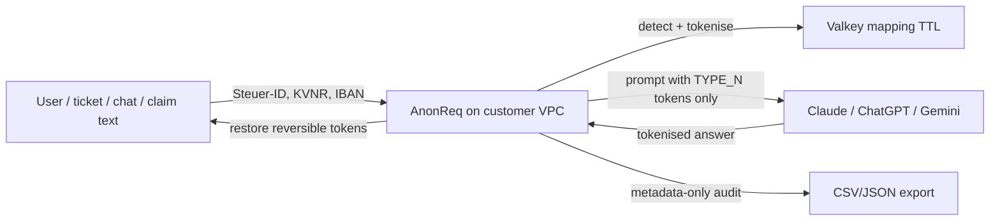

# Germany trust pack

This pack is for a CISO, DPO, and Legal review before a two-week PoC. It is a **narrative and template**, not a certificate. AnonReq does **not** claim BSI C5, ISO 27001, or “GDPR-compliant Claude.”

**Claim we do make:** identifiers never reach the model provider; you get the audit trail a DSB / BaFin reviewer will ask for.

Related: [Germany one-day demo](../operations/germany-demo.md), [German buyer summary](../de/compliance.md).

## Roles

| Setup | Who is controller | Who processes identifiers | Model provider |
| --- | --- | --- | --- |
| Customer runs AnonReq (Docker/Helm) with **their** API key | Customer | Customer’s gateway (in-memory + short-TTL cache). Software vendor is a licensor, not a processor of those identifiers. | Processor / importer of **tokenised** prompts only |
| Vendor-hosted AnonReq (not v1) | Customer | Vendor is a processor — execute a DPA before any such offer | Same as above |

v1 recommendation: **gateway only**, customer-operated. Do not host models.

## Data-flow (tokens leave, values never)

1. Request hits `/v1/chat/completions` (OpenAI-compatible) with `X-AnonReq-Locale: de-DE`.
2. Detection (regex + checksums + optional NER) runs **in the customer environment**.
3. Reversible entities become `[TAX_ID_DE_n]` / `[IBAN_DE_n]` / … Mapping lives in Valkey with TTL, then is deleted.
4. Credentials / API keys are **irreversible**: the mapping is not stored; they are not restored.
5. Fail-closed: if detection, cache, or analyzer is down, the gateway returns 5xx and **does not** forward the raw prompt.
6. Audit events record tenant, time, model, locale, **entity types** — never the raw values.

## GDPR Art. 32 and Art. 44

**Art. 32 (security of processing).** Pseudonymisation and encryption are named safeguards. AnonReq implements reversible pseudonymisation for German national identifiers and irreversible masking for secrets. Access to the mapping is limited to the gateway process; exports omit raw values.

**Art. 44 (transfers).** A US/EU model API is a third-country transfer if personal data is in the prompt. The intended safeguard is that **identifiers are not in the prompt**. Residual risk remains (free-text names that NER misses, unusual formats). The PoC must use the customer’s real tickets to measure residual leakage — do not treat the golden tests as a legal opinion.

**What not to write in a DPA or one-pager:** “AnonReq makes ChatGPT GDPR-compliant.” Write: “Personal identifiers listed in `config/compliance/germany.yaml` are replaced before the provider call; the provider DPA still applies to whatever remains in the prompt.”

## Processing / DPA template (self-hosted)

Use this when Legal asks for a processor clause. For self-hosted v1, prefer a **software licence + support** agreement and a short annex:

- **Subject:** supply of the AnonReq gateway and optional installation support.
- **Personal data processed by vendor:** none in the PoC, if logs stay on customer systems and support sees only redacted screenshots.
- **If support must see traffic:** treat those sessions as processing; purpose = incident response; types = metadata in audit export; retention = ticket lifetime; subprocessors = none unless named.
- **Customer obligations:** operate Helm/Compose, hold the model-provider DPA, set `ANONREQ_ACTIVE_PRESETS=germany`, keep admin keys.
- **International transfers by vendor:** none for self-hosted.
- **Deletion:** mapping TTL + explicit delete after restore; customer wipes volumes on uninstall.

When (and only when) you host the gateway, replace the annex with a full Art. 28 DPA: instructions, confidentiality, subprocessors, deletion, audit rights.

## Technical and organisational measures (TOMs)

| Measure | How AnonReq does it in v1 |
| --- | --- |
| Pseudonymisation | Locale pack `de-DE` + preset `germany` (Steuer-ID, Personalausweis, KVNR, SVNR, DE-IBAN, HR, Aktenzeichen, GDPR PII) |
| Secrets | `API_KEY` irreversible |
| Least privilege | Admin export requires administrator role; gateway API key separate |
| Integrity of logs | Hash-chained audit events; export projects allowlisted metadata keys only |
| Availability / fail-closed | No forward on detection/cache/analyzer failure |
| Encryption in transit | Terminate TLS at ingress; customer provides certificates |
| Encryption at rest | Customer’s cluster / volume encryption; Valkey ephemeral |
| Access control | API key today; Entra ID group mapping is post-PoC |
| Data minimisation | Audit CSV: timestamp, request_id, tenant, operator, model, locale, entity_types, token_count, decision |
| Retention | Mapping TTL (default minutes); audit retention configured by customer |

## EU AI Act (logging and oversight)

AnonReq is **not** the high-risk credit, insurance-pricing, or hiring model. It is middleware in front of a GPAI / chatbot the customer already wants to use.

- **Do not** file AnonReq as the high-risk system.
- **Do** use the anonymisation export as evidence that prompts to the model were logged at the gateway (who, when, which model, which entity *types* were masked).
- Human oversight of the **model’s** output stays with the customer’s process (four-eyes on claims, maker-checker on tickets). The gateway does not replace that.
- Logging duties that started applying to GPAI / certain systems from 2 August 2026 sit with the **deployer of that model**, not with a masking proxy. AnonReq is a supporting control.

## DORA (ICT third-party)

For BaFin-supervised entities, AnonReq (if contracted) is an ICT service supporting a user workspace — not the core banking ledger.

Offer, do not invent, these clauses:

- Description of the ICT service: on-prem anonymisation gateway, OpenAI-compatible proxy.
- Locations: customer VPC / cluster only for v1.
- Subcontractors: none for the gateway process; the **model provider is the customer’s** ICT third party, not ours.
- Exit: Helm uninstall, volume wipe, key rotation at the model provider.
- Incident notice: customer’s existing incident process; gateway fail-closed events are in logs.
- Testing: customer may run the golden leak tests and the round-trip test in their CI.

This pack does not satisfy DORA by itself. It is language for the ICT third-party file.

## Roadmap (not yet true)

- Entra ID / Active Directory group → role mapping
- Air-gap install bundle (no outbound except customer-chosen model endpoints)
- BSI C5 and ISO 27001 **when independently audited** — never in sales copy before that

## PoC evidence checklist

- [ ] `docker compose -f docker-compose.yml -f docker-compose.germany.yml` or Helm overlay `values-germany.yaml`
- [ ] Customer model key only; no vendor-hosted models
- [ ] Sample of **their** tickets or a redacted extract
- [ ] Forwarded prompt screenshot or log: no Steuer-ID / KVNR / IBAN
- [ ] Restored answer usable by ops
- [ ] `/v1/admin/audit/anonymization-export?format=csv` contains entity types, not values
- [ ] This document attached to the PoC folder
