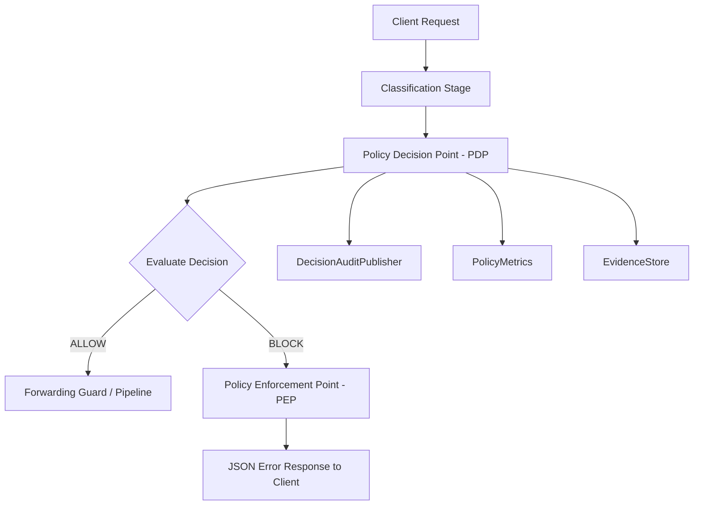

# Enterprise Policy Engine Operational Runbook

Operational guidance, monitoring specs, configuration patterns, and troubleshooting steps for the self-hosted AnonReq Enterprise Policy Engine.

---

## 1. Architecture Overview

The policy engine acts as the gatekeeper in the proxy pipeline, intercepting requests post-classification and checking them against configured limits and rules:



- **PolicyStore**: Dynamically loads and caches policies from Valkey.
- **UsageLimiter**: Manages RPM/TPM/Concurrent rate limits.
- **SpendController**: Evaluates daily/monthly dollar spend limits.
- **ResidencyRouter**: Verifies provider regions match residency rules.

---

## 2. Configuration Guide (`policy.yaml`)

Configuration file location: `config/policy.yaml` (hot-reloaded on SIGHUP or database hot-reload triggers).

### Example Configuration:
```yaml
version: "1.0"
rules:
  - rule_id: "block_restricted"
    name: "Block Restricted Data"
    action: "BLOCK"
    priority: 100
    enabled: true
    conditions:
      classification_level: "Restricted"

rate_limits:
  enabled: true
  rpm: 1000
  tpm: 100000
  concurrent: 10

spend_budgets:
  tenant_a:
    daily_limit: 50.00
    monthly_limit: 1000.00
    currency: "USD"

residency_rules:
  tenant_a:
    allowed_regions:
      - "us-east-1"
      - "eu-west-1"
```

---

## 3. Administrative API Usage

### Query Active Rules:
```bash
curl -X GET http://localhost:8080/v1/admin/policies \
  -H "Authorization: Bearer <ADMIN_API_KEY>" \
  -H "X-AnonReq-Role: operator" \
  -H "X-AnonReq-Tenant-ID: tenant_a"
```

### Upsert Policy Rule (Admin Only):
```bash
curl -X PUT http://localhost:8080/v1/admin/policies/block_untrusted \
  -H "Authorization: Bearer <ADMIN_API_KEY>" \
  -H "X-AnonReq-Role: administrator" \
  -H "Content-Type: application/json" \
  -d '{
    "rule_id": "block_untrusted",
    "name": "Block Untrusted",
    "action": "BLOCK",
    "priority": 90,
    "enabled": true,
    "conditions": {"classification_level": "Highly Restricted"}
  }'
```

### Fetch Current Tenant Usage:
```bash
curl -X GET http://localhost:8080/v1/admin/tenants/tenant_a/usage \
  -H "Authorization: Bearer <ADMIN_API_KEY>" \
  -H "X-AnonReq-Role: operator"
```

---

## 4. Monitoring & Logs

### Prometheus Metrics
- `anonreq_policy_decisions_total{tenant_id, action}`: Counts total decisions.
- `anonreq_policy_denials_total{tenant_id, reason}`: Counts total blocked requests (reason matches rule ID).
- `anonreq_rate_limit_hits_total{tenant_id, limit_type}`: Counts rate limit violations.
- `anonreq_spend_limit_hits_total{tenant_id, budget_type}`: Counts spend limit violations.

### Audit Events (stdout structured JSON)
- `policy_decision_recorded`
- `rate_limit_exceeded`
- `spend_limit_exceeded`
- `routing_policy_violation`
- `classification_block`
- `budget_reset`

---

## 5. Troubleshooting & Incident Response

### Problem: False positive rate limit blocks
1. Run `GET /v1/admin/tenants/{id}/usage` to check `rpm_current` and `concurrent_current`.
2. Inspect Valkey keys starting with `anonreq:limiter:{tenant_id}:`.
3. If concurrent requests are orphaned due to unclosed client streams, clear Valkey keys using the admin console to reset slots.

### Problem: Database/Valkey outage causing 503s
1. The policy engine fails closed (fail-secure). If Valkey goes down, all PDP checks fail, returning `HTTP 503` with code `fail_secure`.
2. Verify Valkey status: `docker compose ps valkey`.
3. Check Valkey logs: `docker compose logs valkey`.
4. PDP recovers automatically within 5 seconds of Valkey recovery.
