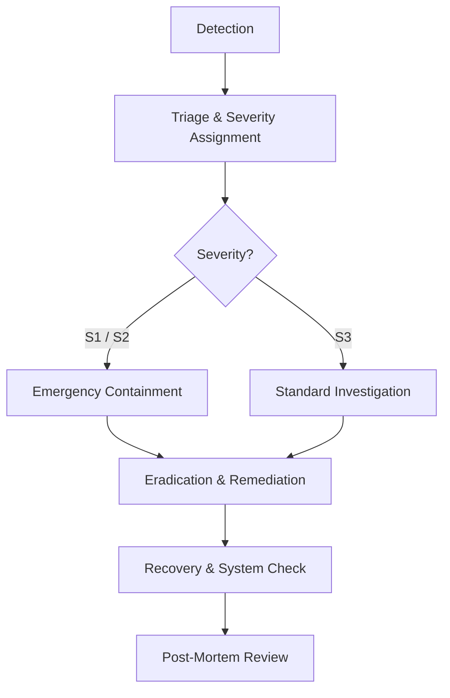

# Incident Response Plan

This document details the incident response protocol for security and reliability anomalies in the AnonReq gateway.

## Severity Classification

| Severity | Definition | Response Time SLA | Example |
|----------|------------|-------------------|---------|
| **S1 (Critical)** | Direct exposure of raw PII/data breach; tampering detected on the immutable audit trail hash chain. | ≤ 1 hour | Sanitization failure resulting in plaintext PII forwarded to external API; anchor signature mismatch. |
| **S2 (Major)** | Complete service unavailability or critical degradation in sanitization pipeline. | ≤ 4 hours | Presidio analyzer container down; all outgoing traffic returning HTTP 500. |
| **S3 (Minor)** | Minor operational warnings or security anomalies. | ≤ 24 hours | Single-instance webhook DLQ growth; P95 latency alerts. |

## Incident Response Flow

### 1. Detection
Incidents are detected via:
- Automated Prometheus alerts (`SLOSuccessRateBreach`, `FailSecureRateBreach`)
- Tamper checks on audit chain status (`/v1/governance/audit/verify`)
- Customer vulnerability reports

### 2. Triage
The on-call engineer assesses the anomaly, confirms the breach, assigns severity classification, and opens an incident ticket.

### 3. Containment
For S1/S2 incidents, execute one or more containment procedures immediately:
- **Emergency Suspension**: Temporarily block all outgoing traffic.
- **Tenant Isolation**: Suspend API keys for the affected tenant.
- **Upstream Rotation**: Disable compromised upstream LLM endpoints.

### 4. Eradication & Remediation
- Identify and isolate the root cause (e.g. faulty regex recognizer, memory leak, PostgreSQL lock).
- Build and test patch fixes.
- Deploy the patched version of the gateway container.

### 5. Recovery
- Restore regular traffic routing.
- Re-run `/v1/governance/audit/verify` to verify the state of the audit trail hash chain.
- Validate that the PII sanitization pipeline checks are fully intact.

### 6. Post-Mortem Review
A blameless post-mortem must be conducted within **5 business days** of any S1 or S2 incident. The review must address:
- Timeline of the incident
- Root cause analysis
- Action items to prevent recurrence
- Attestation of containment
