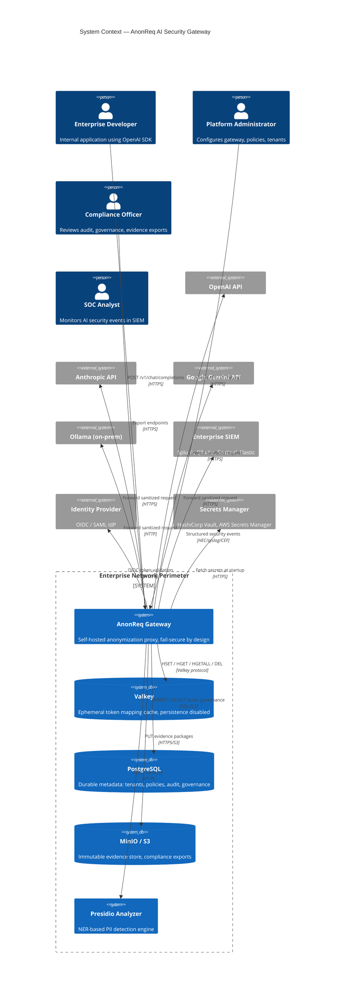
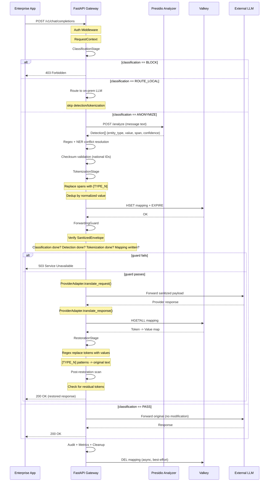
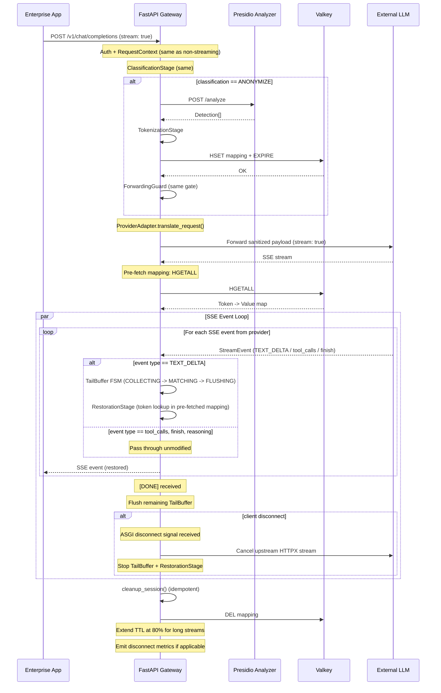
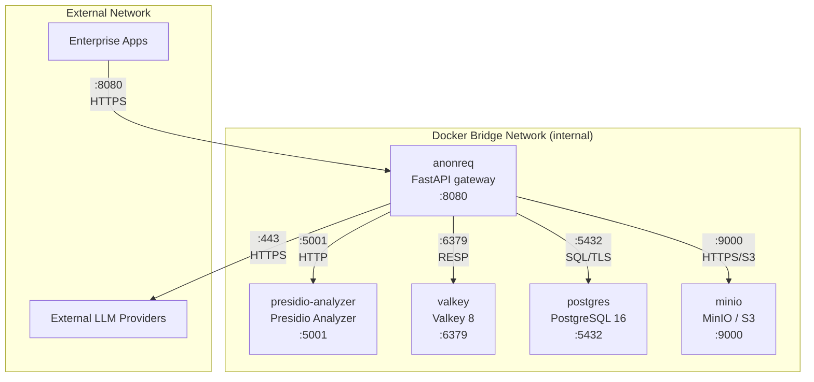
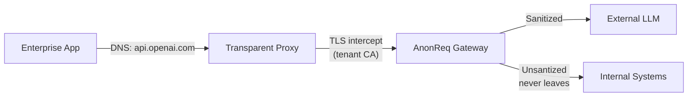

# AnonReq — High Level Design

> AI Security Gateway for Regulated Enterprises
> Document version 1.0 — 2026-06-26

---

## Table of Contents

1. [System Overview](#1-system-overview)
2. [Architecture Principles](#2-architecture-principles)
3. [System Context Diagram](#3-system-context-diagram)
4. [Container Diagram](#4-container-diagram)
5. [Component Architecture](#5-component-architecture)
6. [Request Flow](#6-request-flow)
7. [Data Flow Diagrams](#7-data-flow-diagrams)
8. [Deployment Architecture](#8-deployment-architecture)
9. [Technology Stack](#9-technology-stack)
10. [Integration Architecture](#10-integration-architecture)
11. [Security Architecture](#11-security-architecture)

---

## 1. System Overview

AnonReq is a self-hosted anonymization gateway that sits between enterprise internal applications and external LLM API providers. It intercepts outbound requests, detects and replaces personally identifiable information (PII), protected health information (PHI), financial identifiers, and other sensitive data with context-preserving placeholder tokens, forwards only sanitized payloads to the target LLM provider, and restores original values in the response stream before returning to the calling application — all within the customer's network perimeter.

The architecture follows a stage-registry pipeline model: each security operation (classification, detection, tokenization, forwarding guard, provider translation, restoration) is an independently testable stage registered in a central registry and orchestrated by a PipelineManager. A single `ProcessingContext` is passed through every stage, ensuring no hidden state and complete observability into the decision chain.

The gateway is stateless with respect to application data. Token mappings live ephemerally in Valkey (RAM-only, persistence disabled) and are deleted at terminal response states. All durable metadata — audit logs, tenant configurations, governance records — flows to PostgreSQL. No raw sensitive data is ever written to disk, logged, or included in metrics or traces.

AnonReq presents an OpenAI-compatible wire protocol (`POST /v1/chat/completions`) so existing OpenAI SDK integrations require zero code changes. Provider adapters translate this canonical representation into Anthropic, Gemini, Ollama, and future provider wire formats.

---

## 2. Architecture Principles

### 2.1 Fail-Secure

Any error in classification, detection, tokenization, caching, provider translation, or restoration blocks the request and returns HTTP 5xx. No unsanitized data is ever forwarded upstream under any failure mode. The ForwardingGuard component is the sole gatekeeper authorized to send traffic to external providers and requires a validated `SanitizedEnvelope` before doing so.

### 2.2 Ephemeral Mapping

Token-to-value mappings exist only in Valkey memory. Persistence is explicitly disabled (`save ""`, no AOF, no RDB). Mappings are created with a TTL of 60-3600 seconds and are actively deleted on response completion, stream termination, or client disconnect. TTL is a safety net, not a cleanup strategy.

### 2.3 No PII in Logs

All logs, metrics, traces, UI payloads, error bodies, and exports use a strict field allowlist. Raw prompts, responses, entity values, token strings, secrets, and internal URLs are structurally forbidden. Metadata-only audit is enforced at the serialization layer.

### 2.4 Streaming First

SSE streaming is a first-class path, not a bolt-on. The pipeline shares the same classification, detection, tokenization, and ForwardingGuard stages as the non-streaming path, then diverges into a streaming-specific Tail_Buffer FSM and RestorationStage that reassembles split tokens, restores in real-time, and handles client disconnect cleanly.

### 2.5 Tenant Isolation

All cache keys are tenant-scoped (`anonreq:{tenant_id}:{session_id}`). All durable records carry tenant IDs and are filtered by authorization at query time. No request may access mappings, policies, logs, or configuration belonging to another tenant.

### 2.6 Defense in Depth

Multiple independent detection layers (regex, NER, checksum validation, DLP classifiers, prompt security rules) provide overlapping coverage. Policy evaluation precedes detection, and output scanning follows restoration. A failure in any single layer does not compromise the overall security posture.

### 2.7 Security Before Features

The pipeline (classification -> detection -> tokenization -> ForwardingGuard -> provider -> restoration) is the product. Streaming, multi-provider, locales, compliance presets, governance, and SIEM integrations are features layered on top. Features never compromise pipeline invariants.

---

## 3. System Context Diagram



The gateway is the single entry point for all outbound LLM traffic from the enterprise. External LLM providers see only sanitized, tokenized content. Internal systems (Valkey, Presidio, PostgreSQL, MinIO) operate within the trusted enterprise perimeter and never receive raw sensitive data in durable storage.

---

## 4. Container Diagram

```mermaid
C4Container
  title Container Diagram — AnonReq Runtime Containers

  Person(dev, "Enterprise App", "OpenAI SDK consumer")

  System_Boundary(compose, "Docker Compose Deployment") {

    Container(gateway, "FastAPI Gateway", "Python 3.12, FastAPI, Uvicorn",
      "Request intake, pipeline orchestration, provider routing, restoration")

    Container(presidio, "Presidio Analyzer", "Python, spaCy, NER models",
      "Hybrid regex + NER detection, locale-specific recognizer bundles")

    Container(valkey, "Valkey Server", "Valkey 8, RAM-only",
      "Ephemeral token mappings, rate-limit counters, session state")

    ContainerDb(postgres, "PostgreSQL", "PostgreSQL 16",
      "Durable metadata: tenants, policies, audit, governance, incidents")

    ContainerDb(minio, "MinIO / S3-compatible", "Object storage",
      "Immutable evidence packages, compliance exports, audit archives")
  }

  Container_Ext(provider, "External LLM Provider", "OpenAI / Anthropic / Gemini / Ollama")

  Rel(dev, gateway, "POST /v1/chat/completions\nstream: true/false", "HTTPS :443")
  Rel(gateway, presidio, "POST /analyze\nTextNode payload", "HTTP :5001")
  Rel(gateway, valkey, "HSET / HGET / HGETALL / DEL / EXPIRE", "Valkey protocol :6379")
  Rel(gateway, postgres, "SQL queries (audit, governance, config)", "SQL/TLS :5432")
  Rel(gateway, minio, "PUT evidence packages", "HTTPS/S3 :9000")
  Rel(gateway, provider, "Forward sanitized\nAPI requests", "HTTPS :443")

  Rel_L(presidio, valkey, "Optional: model cache", "Valkey protocol")
```

### 4.1 Container Responsibilities

| Container | Responsibility | Protocol |
|-----------|---------------|----------|
| FastAPI Gateway | Auth, schema validation, pipeline orchestration, detection scanning, tokenization, ForwardingGuard, provider adapter dispatch, restoration, SSE streaming, audit emission, metrics, health | HTTPS (inbound), HTTP (Presidio), Valkey protocol, SQL/TLS (PostgreSQL), S3 (MinIO) |
| Presidio Analyzer | Named Entity Recognition via spaCy NLP pipeline, custom regex recognizer execution, confidence scoring, locale-specific analyzer bundles | HTTP REST /analyze |
| Valkey | Ephemeral token mapping store (session-scoped HSET), rate-limit counters, TTL-based eviction, no persistence | RESP protocol |
| PostgreSQL | Durable tenant config, policy definitions, audit records, governance artifacts, risk assessments, incident records, configuration change history | SQL over TLS |
| MinIO | Immutable evidence packages, compliance report exports, audit trail archives | S3-compatible API |

### 4.2 Inter-Container Communication

- Gateway-to-Presidio: synchronous HTTP POST per TextNode. Timeout 5s, circuit-breaker after 3 failures in 30s.
- Gateway-to-Valkey: async Redis driver (redis-py async), connection pool, pipelined HSET+EXPIRE in single round-trip.
- Gateway-to-PostgreSQL: async SQLAlchemy 2.0 with connection pooling. Writes are fire-and-forget with background retry.
- Gateway-to-MinIO: synchronous PUT for evidence exports. Not on the hot path.

---

## 5. Component Architecture

### 5.1 Gateway API

The FastAPI application is structured as a layer of middlewares wrapping a pipeline orchestrator.

**Routes:**

| Route | Method | Purpose | Phase |
|-------|--------|---------|-------|
| `/v1/chat/completions` | POST | Core anonymization proxy (non-streaming and streaming) | 1-3 |
| `/v1/models` | GET | List configured provider model aliases | 3 |
| `/v1/compliance/presets` | GET | List active compliance presets | 4 |
| `/v1/config/rules` | GET | List active custom detection rules and exclusion lists | 5 |
| `/health` | GET | Readiness probe (checks Valkey, Presidio, PostgreSQL) | 1 |
| `/metrics` | GET | Prometheus metrics endpoint | 5 |

**Middleware Stack (outer to inner):**

1. **Global Exception Handler** — catches all unhandled exceptions, returns static HTTP 500 with no request detail, logs structured error with no PII.
2. **Authentication Middleware** — validates `Authorization: Bearer <token>` against configured API key or future OAuth2/JWT provider.
3. **RequestContext Middleware** — extracts/extends `ProcessingContext` with tenant ID, session ID (UUIDv7), locale header, classification header.
4. **Audit Middleware** — emits `request_started` audit event, captures response metadata for `request_completed`.

**Pipeline Orchestrator:**

```
PipelineManager.run(ctx: ProcessingContext) -> Response
  1. ClassificationStage.evaluate(ctx)
  2. DetectionStage.detect(ctx)           [if classification == ANONYMIZE]
  3. TokenizationStage.tokenize(ctx)      [if classification == ANONYMIZE]
  4. ForwardingGuard.check(ctx)           [always — blocks if invariants fail]
  5. ProviderStage.dispatch(ctx)          [translate + execute or stream]
  6. RestorationStage.restore(ctx)        [non-streaming path]
  7. CleanupStage.clean(ctx)              [DEL mapping, release resources]
```

### 5.2 Detection Engine

The Detection Engine is a hybrid pipeline with two tiers running in sequence:

**Tier 1 — Regex (Deterministic):**

Executes a prioritized list of compiled regex patterns for high-precision identifiers. Operates on each `TextNode` (message content, tool call arguments, JSON leaf values). Regex patterns are organized by entity type and locale.

Supported entity types (base set):
- Email, Phone, Credit Card, IBAN, IP Address, URL, Date of Birth
- National IDs (SSN, SIN, NINO, Aadhaar, Steuer-ID, NIR, CPF, CNPJ, Codice Fiscale, BSN, etc.)
- SWIFT/BIC, Crypto wallet addresses (BTC, ETH)

Regex results include: entity type, matched value, character span (start, end), confidence (always 1.0 for regex), locale association.

**Tier 2 — NER / Presidio (Fuzzy):**

Delegates to Presidio Analyzer for context-aware entity recognition. Runs concurrently per TextNode. Configured with:
- spaCy `en_core_web_sm` model (MVP; swappable per locale)
- Default entity types: PERSON, ORG, LOCATION, ADDRESS, CITY, JOB_TITLE, DATE_TIME
- Confidence threshold (default 0.7, configurable per entity type and locale)

**Conflict Resolution:**

When regex and NER produce overlapping spans, the following rules apply in order:
1. Regex always wins over NER (determinism over probability).
2. Longer span wins among same-tier overlapping detections.
3. Multi-locale detection merges by entity type, highest confidence wins.
4. Exclusion list matches override all detection — excluded values pass through undetected.

**Locale Negotiation (Phase 4):**

The `X-AnonReq-Locale` header triggers locale-specific recognizer bundles:
1. HeaderParser extracts and validates locale codes (e.g., `de-DE, fr-FR`).
2. LocaleRegistry resolves each code to a `LocaleBundle` with entity type configs, checksum validators, and confidence thresholds.
3. RecognizerMerger merges universal recognizers with locale-specific ones, deduplicating by entity type and keeping highest confidence.
4. The merged `RecognizerSet` is passed to the DetectionProvider for scanning.

**Checksum Validation:**

For national IDs with check-digit algorithms (Steuer-ID modulo-11, BSN, NIR, CPF, CNPJ, Codice Fiscale), a post-detection checksum filter drops detections that fail algorithmic validation. This prevents false positives on structurally similar but invalid identifiers.

### 5.3 Tokenization Engine

Replaces detected sensitive spans with placeholder tokens in a single left-to-right pass, processing from the end of the string to preserve character offsets.

**Token Format:**

```
[TYPE_N]
```

Where `TYPE` is an uppercase entity type identifier (e.g., `EMAIL`, `PHONE`, `PERSON`, `CREDIT_CARD`) and `N` is a monotonically increasing integer (per type, per session).

**Deduplication:**

Same normalized entity value within a session maps to the same token. The deduplication table is an in-memory `dict[str, str]` (normalized_value -> token) maintained per `ProcessingContext`. This ensures:
- Same value repeated K times -> 1 unique token, 1 mapping entry.
- Different values of same type -> distinct tokens with different indices.

**Randomization:**

A cryptographically random seed is generated per session (`secrets.token_bytes(32)`). This seed is mixed into the token index assignment to prevent cross-session correlation of token indices.

**Mapping Write:**

After tokenization completes, token mappings are written to Valkey as an HSET:
```
Key:   anonreq:{tenant_id}:{session_id}
Fields:
  TOKEN_1    -> original_value_1
  TOKEN_2    -> original_value_2
  ...
EXPIRE: configured TTL (default 300s)
```

The HSET and EXPIRE are sent as a single pipelined command for atomicity. The mapping write completes before the ForwardingGuard is consulted.

### 5.4 Restoration Engine

**Non-Streaming Path:**

After the provider responds, the restoration engine performs a single regex-based replacement pass over the assembled response content. It matches `[TYPE_N]` tokens using case-insensitive and bracket-optional patterns (matching `[EMAIL_1]`, `[email_1]`, and `EMAIL_1`), looks up each token in the Valkey HSET, and replaces with the original value. The full mapping is prefetched via a single `HGETALL` before replacement begins.

**Streaming Path (SSE):**

The streaming path uses a finite state machine called the **Tail_Buffer** to handle tokens split across SSE chunk boundaries:

```
States:
  COLLECTING  — appending TEXT_DELTA data to tail buffer
  MATCHING    — tail buffer has potential partial token at boundary
  FLUSHING    — complete token matched and replaced, flushing restored text

Transitions:
  COLLECTING -> MATCHING  when tail buffer ends with potential token prefix
  MATCHING   -> FLUSHING  when token completes across chunk boundary
  MATCHING   -> COLLECTING when assembled text contains no token pattern
  FLUSHING   -> COLLECTING after token replaced and flushed
```

The Tail_Buffer maintains at most 512 characters of trailing context. Only TEXT_DELTA events enter the FSM; tool_calls, reasoning, and finish_reason events bypass restoration entirely. Anti-buffering headers (`X-Accel-Buffering: no`, `Cache-Control: no-transform`) prevent intermediate proxy buffering.

**Verification (Phase 5):**

Post-restoration, the assembled response is scanned for residual `\[[A-Z]+_\d+\]` patterns. Any match increments a Prometheus counter (`anonreq_residual_tokens_total`) and logs a warning. This catches restoration failures that would otherwise silently leak token structure.

### 5.5 Cache Manager

The Cache Manager wraps all Valkey interactions:

```
interface CacheManager:
  async def set_mapping(session_id, mapping: dict[str, str], ttl: int)
  async def get_mapping(session_id) -> dict[str, str]
  async def delete_mapping(session_id)
  async def extend_ttl(session_id, ttl: int)
  async def health() -> bool
```

Key behaviors:
- Connection pool with configurable min/max connections (default 5/20).
- All commands through async Redis driver; blocking calls only on dedicated connection for health checks.
- Mapping write uses `FUNCTION LOAD` equivalent or pipelined `HSET` + `EXPIRE` for atomicity.
- TTL extension fires at 80% of configured TTL during long streaming sessions.
- Delete is attempted within 100ms of response write. Idempotent — no error if key already expired.
- Persistence-disabled check runs at startup: connects to Valkey, verifies `save ""` config.
- Health check returns unhealthy if any connection pool slot fails within 2s timeout.
- Rate-limit counters use separate Valkey keyspace with `INCR` + `EXPIRE` atomic pattern.

### 5.6 Provider Adapters

Provider Adapters implement a common interface:

```
interface ProviderAdapter:
    provider_name: str
    capabilities: ProviderCapabilities

    translate_request(ctx: ProcessingContext) -> ProviderRequest
    async execute(request: ProviderRequest) -> ProviderResponse
    async stream_events(request: ProviderRequest) -> AsyncIterator[StreamEvent]
    translate_response(ctx: ProcessingContext, response: ProviderResponse) -> RestoredResponse
```

Each adapter is a pure schema translator. Zero policy logic exists in adapters — they map between the canonical OpenAI-compatible representation and provider-specific wire formats.

**Supported Providers (MVP):**

| Provider | Adapter | Wire Format | Auth |
|----------|---------|-------------|------|
| OpenAI | `OpenAIAdapter` | OpenAI Chat Completions API | API key in header |
| Azure OpenAI | `AzureOpenAIAdapter` | OpenAI-compatible with custom deployment IDs | API key / Entra ID |
| Anthropic | `AnthropicAdapter` | Anthropic Messages API | x-api-key header |
| Google Gemini | `GeminiAdapter` | Gemini generateContent / streamGenerateContent | API key |
| Ollama | `OllamaAdapter` | Ollama chat API | None (internal) |

**Model Alias Resolution:**

```
Client sends: model: "smart-fast"
  -> AliasRegistry.resolve("smart-fast")
  -> (provider="anthropic", model="claude-sonnet-4-20250514")
  -> ProviderRegistry.get_adapter("anthropic")
  -> Adapter translates + dispatches
```

Aliases are defined in YAML config and cached at startup.

### 5.7 Policy Engine

The Policy Engine evaluates requests against configured policies across multiple dimensions:

**Classification (Phase 2):**

A 4-tier classification runs before detection:
- `PASS` — forward without inspection (for known-safe content).
- `ANONYMIZE` — run full detection + tokenization pipeline (default).
- `ROUTE_LOCAL` — redirect to configured on-premise LLM endpoint.
- `BLOCK` — return HTTP 403 with audit entry, no forwarding.

Classification rules are YAML-configurable with regex or entity-type matching on message content, role, or metadata.

**Rate Limiting & Spend Control (Phase 8):**

Per-tenant rate limits (RPM, TPM, concurrent requests) enforced via Valkey counters with sliding window. Spend budgets (daily, monthly) tracked as atomic accumulators. Both return HTTP 429/402 with structured error bodies.

**DLP & Firewall (Phases 10, 13):**

Inbound prompt inspection for injection/jailbreak patterns. Outbound response inspection for policy-violating content, PII reconstruction attempts, and data exfiltration encoding. Each event is logged with MITRE ATT&CK technique mapping.

**Data Classification (Phase 12):**

Five levels (Public, Internal, Confidential, Restricted, Highly Restricted) determined by auto-classification from detected entities or client assertion. Per-level handling policies determine the pipeline action.

### 5.8 Audit & Evidence Center

**Operational Audit:**

Structured JSON log entries written to stdout with strict field allowlist:

```
Allowed: timestamp, level, event_type, session_id, tenant_id, locale,
         compliance_preset, classification, entity_counts (by type, no values),
         provider, model, latency_ms, action_code, failure_class,
         request_id, source_ip (anonymized last octet)

Forbidden: raw prompt, raw response, token values, original entity values,
           secrets, internal URLs, full IP addresses
```

**Durable Audit (Phase 11+):**

Immutable audit records in PostgreSQL with HMAC-chained integrity. Append-only, no DELETE/UPDATE. Records include:
- Event type, timestamp, tenant ID, session ID.
- Entity type counts (no values).
- Policy action, provider, model, classification.
- HMAC of previous record hash for chain integrity.

**Evidence Center (Phase 16+):**

On-demand evidence packages (ZIP with JSON manifest, SHA-256 manifest) for compliance reporting. Includes: governance records, risk assessments, config audit history, bias reports, incident summaries. Exported to MinIO for immutable retention.

### 5.9 Admin & Governance Plane

**Admin API (Phase 9+, deferred to Stage 2):**

- CRUD for tenants, policies, provider configurations.
- User management with RBAC (roles: viewer, operator, administrator, compliance, security).
- Session and mapping queries (metadata only).
- Health dashboard and configuration validation.

**Governance API (Phase 14+):**

- Governance records with named owners and review cycles.
- Risk assessment CRUD across 6 dimensions.
- Human oversight: approval queue, kill-switch, session summaries (metadata).
- Transparency endpoints: `X-AnonReq-Processed` and `X-AnonReq-Entity-Count` response headers.
- Conformity assessment package generation.

### 5.10 Connector Runtime

**SIEM Connectors (Phase 20):**

- Structured event generation for firewall violations, DLP actions, shadow AI detection, agent governance.
- Sink adapters: Splunk HEC, IBM QRadar syslog CEF, Microsoft Sentinel DCR API, Elastic Bulk API, Datadog Logs API.
- Local event buffer (max 10k events) with exponential backoff retry.

**Transparent Proxy (Phase 17):**

- TLS interception with tenant-managed CA certificate and re-origination.
- Traffic classification: identify AI API traffic by hostname/IP across 8+ providers.
- Block non-intercepted AI traffic via configurable policy.

**CASB & RAG (Phase 19):**

- AI SaaS usage monitoring via corporate proxy/CASB telemetry.
- RAG document inspection at retrieval injection point.
- Full detection pipeline applied to retrieved content before LLM exposure.

---

## 6. Request Flow

### 6.1 Non-Streaming Flow



### 6.2 Streaming Flow



---

## 7. Data Flow Diagrams

### 7.1 Sensitive Data Flow

```
Raw PII crosses these internal boundaries ONLY:
  Client Request -> Detection Engine (memory, in-process)
  Detection Engine -> Tokenization Engine (memory, in-process)
  Tokenization Engine -> Valkey (network, ephemeral, TTL-bound, persistence disabled)

Raw PII NEVER crosses:
  Gateway -> External LLM (sanitized payload only)
  Gateway -> PostgreSQL (counts/hashes only)
  Gateway -> stdout/logs (metadata only)
  Gateway -> Prometheus (counts only)
  Gateway -> MinIO/S3 (counts, metadata, HMAC tags only)
```

### 7.2 Durable Metadata Flow

```
Gateway -> PostgreSQL:
  [audit_events]   session_id, tenant_id, event_type, entity_type_counts,
                   classification, provider, model, timestamp, latency_ms
  [policy_versions] policy_id, version, hash, active_from, author
  [governance]     tenant_id, owner, risk_assessment, review_date
  [incidents]      session_id, classification, severity, resolution

Gateway -> MinIO/S3 (on-demand):
  evidence_export.zip:
    - manifest.json (SHA-256 manifest)
    - governance-records.jsonl
    - config-audit.jsonl
    - risk-assessments.jsonl
    - sbom.json (CycloneDX)

Gateway -> SIEM (Phase 20):
  Structured events: firewall_violation, dlp_action, shadow_ai_detected,
                     prompt_security_event, agent_governance_action
  Fields: mitre_technique_id, severity, event_type, tenant_id, session_id
  No raw prompt content in any event.
```

### 7.3 Audit Flow

```
ProcessingContext created
  -> emit "request_started" (session_id, tenant_id, provider, model)
  -> emit "classification_result" (action, rules_matched[])
  -> emit "detection_summary" (entity_type_counts[], locale, locale_checksum_invalidations)
  -> emit "tokenization_summary" (token_count_by_type, dedup_hits)
  -> emit "forwarding_decision" (allowed, reason_if_blocked)
  -> emit "provider_response" (status_code, latency_ms, token_count)
  -> emit "restoration_summary" (tokens_restored, residual_found)
  -> emit "request_completed" (status_code, total_latency_ms, error_class)

All events are metadata-only. No single event contains enough information
to reconstruct a raw prompt or response.
```

---

## 8. Deployment Architecture

### 8.1 Docker Compose Topology



### 8.2 Container Configuration

| Service | Image | Ports | Dependencies | Healthcheck |
|---------|-------|-------|--------------|-------------|
| anonreq | custom multi-stage Dockerfile, Python 3.12-slim | 8080:8080 | valkey, presidio | `/health` route |
| presidio-analyzer | `mcr.microsoft.com/presidio-analyzer:latest` | 5001 | none | `GET /health` |
| valkey | `valkey/valkey:8-alpine` | 6379 | none | `PING` |
| postgres (Stage 2+) | `postgres:16-alpine` | 5432 | none | `pg_isready` |
| minio (Stage 2+) | `minio/minio:latest` | 9000, 9001 | none | health endpoint |

### 8.3 Healthcheck Sequencing

```
Startup sequence:
  1. valkey (fast, < 2s)
  2. presidio-analyzer (slow, model loading ~30-60s)
  3. anonreq (starts after valkey + presidio healthy)

Startup pre-flight:
  - Verify Valkey reachable (PING)
  - Verify Valkey persistence disabled (CONFIG GET save)
  - Verify Presidio reachable (GET /health)
  - Verify ANONREQ_API_KEY length >= 32
  - Load YAML configs (rules, locales, providers, compliance presets)
  - Verify compliance preset integrity (mandatory entity types present)
  - Register all routes
  - Log successful startup or fail with clear error

Readiness: gateway responds 200 at /health only when all dependencies healthy.
Liveness: gateway responds 200 at /health/self when process is alive, regardless of dependencies.
```

### 8.4 Resource Requirements (MVP)

| Service | CPU | Memory | Storage |
|---------|-----|--------|---------|
| anonreq | 0.5 core | 512 MB | 100 MB (code + model artifacts) |
| presidio-analyzer | 1.0 core | 2 GB | 1.5 GB (spaCy models) |
| valkey | 0.5 core | 256 MB + data | 50 MB (ephemeral, no persistence) |
| postgres (Stage 2+) | 0.5 core | 1 GB | 10 GB (durable records) |
| minio (Stage 2+) | 0.5 core | 512 MB | 100 GB (evidence packages) |

### 8.5 Scaling Model

- **Gateway**: Horizontally scalable (stateless). Each instance needs its own Valkey connection pool. Session affinity not required (mapping keyed by session_id across all instances).
- **Valkey**: Standalone in MVP. Valkey Sentinel or Cluster for HA in Stage 2+.
- **Presidio**: Horizontally scalable (stateless). Load-balanced behind a simple round-robin if needed.
- **PostgreSQL**: Single instance in MVP. Read replicas for audit queries in Stage 2+.
- **MinIO**: Single instance in MVP. Distributed mode for HA in Stage 2+.

---

## 9. Technology Stack

| Layer | Technology | Rationale |
|-------|-----------|-----------|
| Language | Python 3.12 | Best ecosystem fit for Presidio integration, strong typing via type hints, async support via asyncio |
| Web Framework | FastAPI 0.138+ | Native async, OpenAPI generation, Pydantic v2 validation, SSE support, ASGI compliant |
| ASGI Server | Uvicorn 0.49+ | Production ASGI server, HTTP/1.1 and HTTP/2, graceful shutdown |
| Validation | Pydantic v2 | Runtime type checking, JSON Schema generation, Settings management via pydantic-settings |
| HTTP Client | HTTPX 0.28+ | Async HTTP client, connection pooling, streaming response support, pluggable transports |
| PII Detection | Microsoft Presidio Analyzer | Mature NER pipeline with spaCy, regex support, locale extensibility, active community |
| NLP | spaCy (en_core_web_sm) | Fast, production-proven NLP, small model footprint, easy model swap per locale |
| Cache | Valkey / Redis (via redis-py 8+) | Open-source Redis fork, no licensing concerns, in-memory with hash operations |
| Database (Stage 2+) | PostgreSQL 16 via SQLAlchemy 2.0 | Durable metadata, async driver, JSON fields, HMAC chain support |
| Object Storage (Stage 2+) | S3-compatible (MinIO) | Immutable evidence store, compliance exports, industry-standard API |
| Configuration | YAML (via PyYAML 6+) | Human-readable config files, locale bundles, provider definitions, policy rules |
| Metrics | Prometheus client 0.25+ | Industry-standard metrics exposition, histogram support, counter/ gauge patterns |
| Logging | structlog + python-json-logger | Structured JSON logging, context preservation, field allowlist enforcement |
| Container | Docker multi-stage, Python 3.12-slim | Minimal attack surface, reproducible builds, layered caching |
| Orchestration (MVP) | Docker Compose | Single-host deployment, dependency sequencing, network isolation |
| CI/CD | GitHub Actions | Lint, type-check, unit + property + integration tests, container build, SBOM, vulnerability scan |
| Testing | pytest 9+, Hypothesis 6.155+ | Property-based tests for round-trip correctness, token uniqueness, fail-secure invariants |
| Provider Testing | respx 0.21+ | HTTP mocking for provider adapter contract tests |
| Schema | OpenAPI 3.1 | Auto-generated API documentation, SDK generation, client contract validation |

### Rationale for Key Decisions

- **Python over Go/Rust**: Presidio has no equivalent in Go/Rust. Wrapping Presidio in a sidecar and implementing the gateway in Go was considered but rejected due to increased deployment complexity and the marginal latency benefit not being critical at this stage (P95 target is 100ms overhead, not microseconds).

- **FastAPI over Flask/Django**: Native async support is required for SSE streaming without blocking the event loop. FastAPI's Pydantic integration provides zero-cost validation and OpenAPI generation. Django's ORM is overkill for a stateless gateway.

- **Valkey over Redis**: Valkey is the open-source Linux Foundation fork of Redis. Identical API, no licensing uncertainty. Redis 8+ license changes (RSAL) would create enterprise compliance risk.

- **Presidio over custom NER**: Building production-quality NER for 8 locales is a multi-year effort. Presidio provides spaCy-based NER out of the box with locale extensibility, checksum support, and active community maintenance.

- **OpenAI-compatible wire protocol**: The fastest path to enterprise adoption is zero-code-change integration. Every major AI SDK supports OpenAI-compatible endpoints. No custom client libraries needed.

- **Single pipeline for streaming and non-streaming**: Shared stages (classification, detection, tokenization, ForwardingGuard) ensure identical security guarantees regardless of response mode. The pipeline diverges only at the ProviderStage, where streaming vs. non-streaming paths are selected.

---

## 10. Integration Architecture

### 10.1 Enterprise Integration Points

| System | Integration Method | Purpose | Phase |
|--------|--------------------|---------|-------|
| Corporate Proxy | Forward proxy config in env vars | Route outbound traffic through gateway | 1 |
| Identity Provider | OIDC / SAML via middleware | SSO for admin UI, token validation | 9+ |
| Secrets Manager | HashiCorp Vault / AWS Secrets Manager | Provider API keys, mTLS certs at startup | 9+ |
| SIEM | HEC / syslog CEF / DCR API / Bulk API | Security event ingestion | 20 |
| Object Storage | S3-compatible API | Evidence packages, audit archives | 16+ |
| CASB | REST API / agent telemetry | AI SaaS usage monitoring | 19 |
| LDAP | LDAP bind | Admin user sync (Stage 2+) | 9+ |

### 10.2 Transparent Proxy Mode (Stage 3)



In transparent proxy mode, the gateway intercepts all outbound TLS connections to known LLM API endpoints using a tenant-managed CA certificate. Traffic is decrypted, inspected, policy-evaluated, sanitized, re-encrypted, and forwarded. Non-AI traffic passes through unmodified.

### 10.3 RAG Pipeline Integration (Stage 3)

```
RAG Retrieval -> Retrieved Chunks -> AnonReq Detection -> Tokenize -> LLM -> Restore -> User

The detection pipeline runs on retrieved RAG content before it reaches the LLM.
Token mappings persist across the RAG round-trip so tokens in the LLM response
(which referenced retrieved content) are correctly restored.
```

### 10.4 SIEM Integration (Stage 3)

```
AnonReq events -> Local Buffer (10k cap, FIFO) -> Sink Adapter -> Enterprise SIEM

Event types:
  - firewall_violation           (prompt injection, jailbreak, output violation)
  - dlp_action                   (PII reconstruction, data exfiltration)
  - shadow_ai_detected           (unapproved provider traffic)
  - prompt_security_event        (injection scored above threshold)
  - agent_governance_action      (tool blocked, approval required)
  - fail_secure                  (pipeline blocked request)

All events include mitre_technique_id, severity, tenant_id, session_id, timestamp.
No raw prompt or response content in any event.
Local buffer discards oldest events on overflow, never blocks pipeline processing.
```

---

## 11. Security Architecture

### 11.1 Trust Boundaries

```mermaid
graph TB
  subgraph TB0[Trust Boundary 0: Untrusted]
    CLIENT[Enterprise Apps\n(authenticated but untrusted\nfor sensitive content)]
    LLM[External LLM Providers\n(untrusted, outside perimeter)]
  end

  subgraph TB1[Trust Boundary 1: Gateway Processing]
    direction TB
    GW[FastAPI Gateway\n-memory only-\n-no disk write-]
    PI[Presidio Analyzer]
    VK[Valkey\n-RAM only-\n-persistence disabled-]
    MAP[(Token Mappings\n-ephemeral-\n-TTL scoped-)]
  end

  subgraph TB2[Trust Boundary 2: Durable Systems]
    PG[(PostgreSQL\n-audit metadata only-\n-no raw values-)]
    MI[(MinIO\n-evidence only-\n-no raw values-)]
    LOG[stdout Logs\n-field allowlist enforced-]
    MET[Prometheus Metrics\n-counters, histograms only-]
  end

  CLIENT -->|"Raw PII possible"| GW
  GW -->|"Sanitized only"| LLM
  GW -->|"Entity spans"| PI
  GW -->|"Token mappings"| VK
  VK --> MAP
  GW -->|"Metadata only"| PG
  GW -->|"Evidence packages"| MI
  GW -->|"Allowlisted fields"| LOG
  GW -->|"Counters only"| MET

  style TB0 fill:#f5f5f5,stroke:#999
  style TB1 fill:#e8f5e9,stroke:#4caf50
  style TB2 fill:#e3f2fd,stroke:#2196f3
```

| Boundary | Description | Risk |
|----------|-------------|------|
| TB0 | Outside enterprise perimeter. Raw PII may exist in client requests. External LLMs are untrusted by default. | External LLM could be compromised or malicious. |
| TB1 | In-memory processing within enterprise perimeter. Raw sensitive data exists here transiently. No data written to disk. | Memory dump, process compromise, detection bypass. |
| TB2 | Durable systems storing metadata only. No raw values, no token mappings. | Audit log reconstruction attack, metadata correlation. |

### 11.2 Threat Model Summary

| Threat | Impact | Mitigation | Control ID |
|--------|--------|------------|------------|
| Detection false negative forwards PII | Critical | Overlapping regex + NER tiers, DLP classifiers, prompt security rules, configurable confidence thresholds | CT-01 |
| Cache outage blocks production traffic | High | Fail-secure 503 on cache unavailability, HA Valkey in Stage 2+ | CT-02 |
| Logs contain raw PII | Critical | Field allowlist enforced at serializer, property tests verify no PII in logs | CT-03 |
| Tenant data leak via cache | Critical | Tenant-scoped cache keys (`anonreq:{tenant_id}:{session_id}`), authz filters on queries | CT-04 |
| Provider adapter schema drift leaks data | High | Contract tests with provider mocks, OpenAPI as source of truth | CT-05 |
| Token mapping cache persistence enabled | Critical | Startup pre-flight checks Valkey `save ""`, no AOF, no RDB, property tests verify ephemeral | CT-06 |
| Prompt injection bypasses pipeline | High | Inbound prompt security inspection, configurable threshold, 3 actions (block/flag/monitor) | CT-07 |
| Residual tokens in response leak mapping | Low | Post-restoration scan, Prometheus counter, warning log | CT-08 |
| Secrets in error responses | Critical | Global exception handler returns static 500 with no detail, field allowlist on all error bodies | CT-09 |
| Unsanitized forwarding on pipeline error | Critical | ForwardingGuard requires signed SanitizedEnvelope, pipeline error before guard = 503 | CT-10 |
| Compliance preset disabled by misconfiguration | High | Startup validation hard-fails if preset-mandated entity types are disabled | CT-11 |

### 11.3 Control Implementation per Trust Boundary

**TB0 -> TB1 (Client -> Gateway)**
- TLS 1.3 for all inbound connections.
- Authentication via `Authorization: Bearer` token (Static API key in MVP, OAuth2/JWT/OIDC in Stage 2+).
- Request body size limit (configurable, default 10MB).
- Rate limiting on auth failures (5 attempts per second per IP).
- `X-AnonReq-Classification` header accepted but validated against detection output (higher of two wins).

**TB1 -> LLM (Gateway -> External Provider)**
- Only ForwardingGuard may send upstream traffic. Requires validated `SanitizedEnvelope`.
- SanitizedEnvelope contains: tenant_id, session_id, policy_decision, detection_checksum, tokenization_checksum, provider_route, cache_write_confirmation.
- Any missing or invalid field blocks forwarding with 503.
- Provider API keys stored in secrets manager, never logged or included in error responses.
- TLS 1.3 for all outbound connections to external providers.
- Request timeout (configurable, default 30s) prevents connection hanging.

**TB1 -> TB2 (Gateway -> Durable Systems)**
- PostgreSQL receives metadata only. No raw prompts, responses, or token values.
- MinIO receives evidence packages only. No raw sensitive data.
- Logs use structlog with field allowlist enforced at the serializer level. Non-allowlisted fields are stripped, not redacted.
- Prometheus counters track entity counts by type (not values), latency histograms, error rates.
- OpenTelemetry spans attached to parent trace; span attributes use IDs, counts, and component names only.

**TB1 Internal (Gateway -> Presidio -> Valkey)**
- Presidio runs on internal Docker network. No inbound access from outside.
- Valkey binds to internal network only. No password in MVP (network-isolated); configurable ACL in Stage 2+.
- Valkey persistence explicitly disabled. Startup pre-flight verifies `save ""`, no AOF, no RDB.
- Valkey memory limit (configurable, default 256MB) with `maxmemory-policy allkeys-lru`.

### 11.4 Authentication and Authorization Model

**MVP Phase 1:**

- Single static bearer token (`ANONREQ_API_KEY`, minimum 32 characters).
- All routes except `/health` require valid token.
- Token validated in middleware before request reaches any route handler.
- Startup fails if `ANONREQ_API_KEY` is unset or less than 32 characters.

**Stage 2+ (Enterprise):**

- OAuth2 / OIDC integration via IdP.
- JWT token validation with public key caching.
- RBAC with roles: `viewer`, `operator`, `administrator`, `compliance`, `security`.
- Permission matrix enforced at route handler level:
  - `viewer`: GET /health, GET /metrics, GET /v1/models
  - `operator`: POST /v1/chat/completions, GET /v1/config/rules
  - `administrator`: All operator + CRUD tenants, policies, provider configs
  - `compliance`: GET audit, governance, evidence exports
  - `security`: GET SIEM status, incident management
- mTLS between internal services (Stage 2+).

### 11.5 Secrets Management

**MVP:**
- Provider API keys in environment variables via `.env` file.
- Single gateway API key in `ANONREQ_API_KEY` environment variable.
- No secrets written to disk at runtime.
- Docker secrets or `.env` excluded from version control.

**Stage 2+:**
- Secrets loaded from HashiCorp Vault, AWS Secrets Manager, or Azure Key Vault at startup.
- Provider credentials rotated without gateway restart via periodic reload.
- Internal mTLS certificates managed through secrets manager.
- Audit trail for all secrets access.

### 11.6 Security Release Gates

Every phase must pass before being considered complete:

1. **Fail-secure gate**: Property tests verify zero provider forwards on all failure scenarios (detection error, cache timeout, cache unavailable, tokenization error, restoration error).
2. **No-PII-in-logs gate**: Property tests verify synthetic PII across all pipeline paths produces zero PII substrings in log output.
3. **Tenant isolation gate**: Integration tests verify concurrent request isolation across tenant namespaces.
4. **Residual token gate**: Post-restoration scan produces zero residual token matches on all test fixtures.
5. **Audit completeness gate**: All required audit events (request_started, classification_result, forwarding_decision, request_completed) are emitted for every request.
6. **Metrics gate**: All Prometheus counters and histograms are exposed at `/metrics`.
7. **Contribution gate**: All new admin endpoints covered by RBAC matrix tests.

---

*This HLD maps to the three-stage roadmap: MVP (Phases 1-7), Enterprise Platform (Phases 8-16), and Appliance Moat (Phases 17-21). Components marked "Stage 2+" or "Phase X+" are deferred beyond the initial MVP delivery. The core pipeline (Sections 5.1-5.6) and security architecture (Section 11) define the minimum viable product boundaries.*

*Referenced documents: MASTER-ARCHITECTURE.md, MASTER-SECURITY-MODEL.md, MASTER-DATA-FLOW.md, MASTER-DEPENDENCY-GRAPH.md, MASTER-OBSERVABILITY.md, MASTER-RISK-REGISTER.md, ARCHITECTURE_GUARDRAILS.md, ROADMAP.md, PROJECT.md.*
