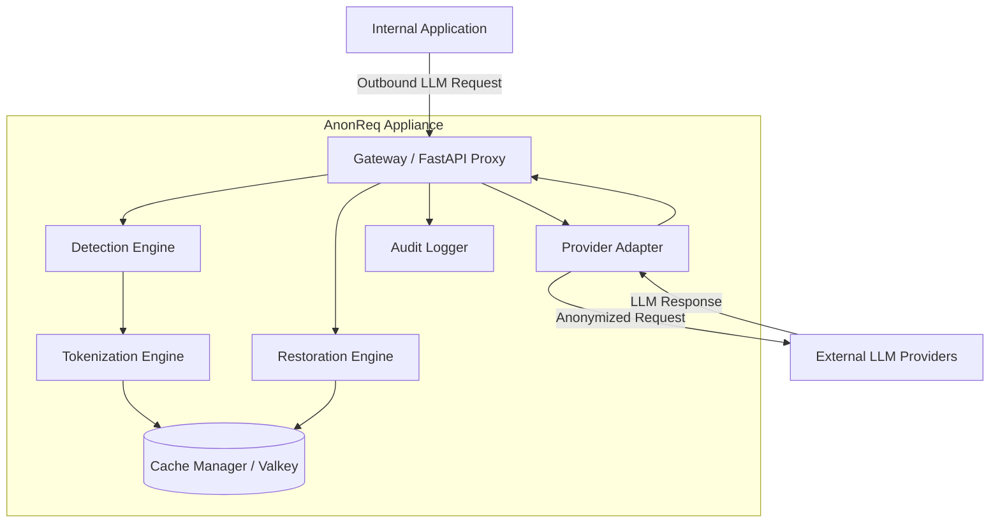

# AnonReq Component Architecture

```mermaid
graph TD
    Client[Internal Application] -->|Outbound LLM Request| Gateway
    
    subgraph AnonReq Appliance
        Gateway[Gateway / FastAPI Proxy]
        DetectionEngine[Detection Engine]
        TokenizationEngine[Tokenization Engine]
        RestorationEngine[Restoration Engine]
        CacheManager[(Cache Manager / Valkey)]
        ProviderAdapter[Provider Adapter]
        AuditLogger[Audit Logger]
        
        Gateway --> DetectionEngine
        DetectionEngine --> TokenizationEngine
        TokenizationEngine --> CacheManager
        Gateway --> ProviderAdapter
        ProviderAdapter --> Gateway
        Gateway --> RestorationEngine
        RestorationEngine --> CacheManager
        Gateway --> AuditLogger
    end
    
    ProviderAdapter -->|Anonymized Request| LLM[External LLM Providers]
    LLM -->|LLM Response| ProviderAdapter
```
