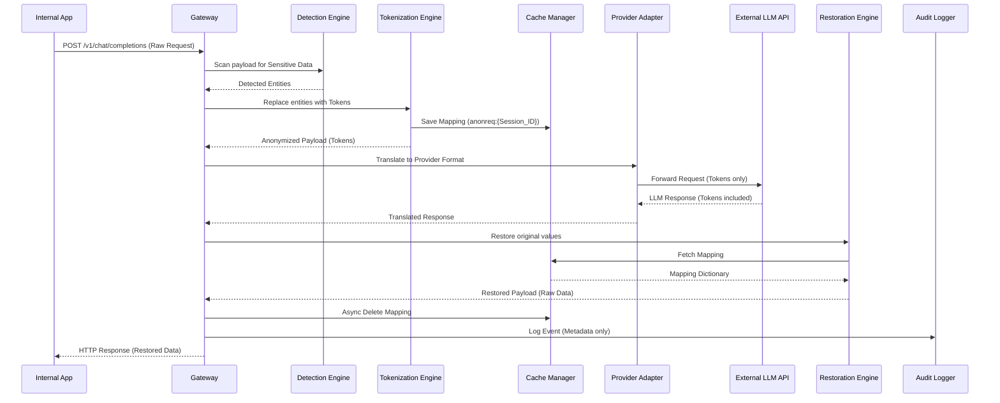

# AnonReq Request-Response Lifecycle

```mermaid
sequenceDiagram
    participant Client as Internal App
    participant GW as Gateway
    participant DE as Detection Engine
    participant TE as Tokenization Engine
    participant Cache as Cache Manager
    participant PA as Provider Adapter
    participant LLM as External LLM API
    participant RE as Restoration Engine
    participant Audit as Audit Logger

    Client->>GW: POST /v1/chat/completions (Raw Request)
    GW->>DE: Scan payload for Sensitive Data
    DE-->>GW: Detected Entities
    GW->>TE: Replace entities with Tokens
    TE->>Cache: Save Mapping (anonreq:{Session_ID})
    TE-->>GW: Anonymized Payload (Tokens)
    GW->>PA: Translate to Provider Format
    PA->>LLM: Forward Request (Tokens only)
    LLM-->>PA: LLM Response (Tokens included)
    PA-->>GW: Translated Response
    GW->>RE: Restore original values
    RE->>Cache: Fetch Mapping
    Cache-->>RE: Mapping Dictionary
    RE-->>GW: Restored Payload (Raw Data)
    GW->>Cache: Async Delete Mapping
    GW->>Audit: Log Event (Metadata only)
    GW-->>Client: HTTP Response (Restored Data)
```
